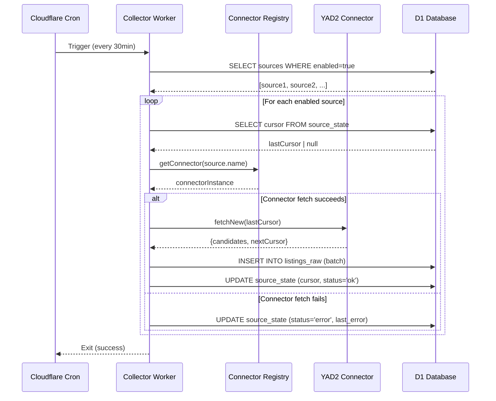

# Collector Worker Design

**Spec**: `.specs/features/collector-worker/spec.md`
**Status**: Draft

---

## Architecture Overview

The collector worker is a cron-triggered Cloudflare Worker that orchestrates incremental data fetching from multiple rental listing sources. It runs every 30 minutes, queries enabled sources from the database, delegates fetching to registered connectors, stores raw payloads in D1, and advances cursors for the next run.

**Design principle**: Fault isolation — one failing connector must not block others.



---

## Code Reuse Analysis

Greenfield — establishing patterns:

- **Connector abstraction**: All connectors implement `Connector` from `@rentifier/connectors`
- **Error boundaries**: Each connector execution wrapped in try-catch to isolate failures
- **Batch inserts**: Raw listings batched to respect D1's per-request limits (1000 rows recommended)
- **State management**: Source state updates use transactions where D1 supports them; fallback to individual updates

---

## Components

### Worker Entry Point

- **Purpose**: Cron handler that orchestrates the entire collection cycle
- **Location**: `apps/collector/src/index.ts`
- **Interfaces**:
  ```typescript
  export default {
    async scheduled(
      event: ScheduledEvent,
      env: Env,
      ctx: ExecutionContext
    ): Promise<void> {
      await runCollector(env.DB);
    }
  };

  interface Env {
    DB: D1Database;
  }
  ```
- **Dependencies**: `@cloudflare/workers-types`, `@rentifier/db`

### Core Collector Logic

- **Purpose**: Main orchestration function that loops over sources and delegates to connectors
- **Location**: `apps/collector/src/collector.ts`
- **Interfaces**:
  ```typescript
  export async function runCollector(db: D1Database): Promise<CollectorResult>;

  interface CollectorResult {
    totalSources: number;
    successCount: number;
    errorCount: number;
    skippedCount: number;
    totalFetched: number;
    errors: Array<{ sourceId: number; error: string }>;
  }
  ```
- **Dependencies**: `@rentifier/db`, `@rentifier/connectors`, `@rentifier/core`

### Connector Registry

- **Purpose**: Maps source names to connector instances for dynamic lookup
- **Location**: `apps/collector/src/registry.ts`
- **Interfaces**:
  ```typescript
  export class ConnectorRegistry {
    private connectors: Map<string, Connector>;

    constructor();
    register(name: string, connector: Connector): void;
    get(name: string): Connector | undefined;
    has(name: string): boolean;
  }

  export function createDefaultRegistry(): ConnectorRegistry;
  ```
- **Dependencies**: `@rentifier/connectors`

### Per-Source Fetch Handler

- **Purpose**: Error-isolated fetch logic for a single source
- **Location**: `apps/collector/src/fetch-source.ts`
- **Interfaces**:
  ```typescript
  export async function fetchSource(
    db: D1Database,
    source: Source,
    connector: Connector
  ): Promise<FetchSourceResult>;

  interface FetchSourceResult {
    sourceId: number;
    success: boolean;
    fetchedCount: number;
    nextCursor: string | null;
    error?: string;
  }
  ```
- **Dependencies**: `@rentifier/db`, `@rentifier/connectors`, `@rentifier/core`

### Batch Insert Helper

- **Purpose**: Efficiently insert raw listings in batches to respect D1 limits
- **Location**: `apps/collector/src/batch-insert.ts`
- **Interfaces**:
  ```typescript
  export async function batchInsertRawListings(
    db: D1Database,
    sourceId: number,
    candidates: ListingCandidate[]
  ): Promise<number>;

  const BATCH_SIZE = 500; // Conservative limit for D1
  ```
- **Dependencies**: `@rentifier/db`, `@rentifier/core`

---

## Data Models

### Internal Types

```typescript
// Re-exported from @rentifier/core for convenience
export type { ListingCandidate, Source, SourceState } from '@rentifier/core';

// Connector interface from @rentifier/connectors
export interface Connector {
  readonly sourceId: string;
  readonly sourceName: string;

  /**
   * Fetch new listings since the given cursor.
   * @param cursor - Last cursor position, or null for initial fetch
   * @returns Candidates and next cursor position
   */
  fetchNew(cursor: string | null): Promise<FetchResult>;
}

export interface FetchResult {
  candidates: ListingCandidate[];
  nextCursor: string | null;
}

// From @rentifier/core
export interface ListingCandidate {
  sourceId: string;
  sourceItemId: string;
  url: string;
  rawData: Record<string, unknown>;
  fetchedAt: Date;
}
```

### Database Row Shapes

```typescript
// From @rentifier/db/schema.ts
export interface Source {
  id: number;
  name: string;
  enabled: boolean;
  created_at: string;
}

export interface SourceState {
  source_id: number;
  cursor: string | null;
  last_run_at: string | null;
  last_status: 'ok' | 'error' | null;
  last_error: string | null;
}

export interface ListingRaw {
  id: number;
  source_id: number;
  source_item_id: string;
  url: string;
  raw_json: string; // JSON.stringify(candidate.rawData)
  fetched_at: string;
}
```

---

## Error Handling Strategy

| Scenario | Handling | Recovery |
|----------|----------|----------|
| No enabled sources in DB | Log warning, return early with `totalSources: 0` | No error thrown; worker exits cleanly |
| Connector not registered for source | Log warning, increment `skippedCount`, continue to next source | Source state unchanged; logged for debugging |
| Connector `fetchNew()` throws | Catch exception, update `source_state.last_status='error'`, `last_error=message`, continue to next source | Other sources unaffected; error recorded for monitoring |
| D1 insert fails (network/quota) | Catch exception, log error, mark source as failed | Cursor not advanced; next run retries from last position |
| Batch too large for D1 | Split into sub-batches of 500 rows, insert sequentially | Slower but reliable; logs warning if split occurs |
| Worker timeout approaching (30s) | Stop processing remaining sources, log which were skipped | Partial run; skipped sources run next cycle |
| Duplicate raw listing insert | `ON CONFLICT IGNORE` at DB level, silent skip | Idempotent; no error, no duplicate row |

---

## Tech Decisions

| Decision | Rationale | Trade-off |
|----------|-----------|-----------|
| Cron schedule: 30 minutes | Balances freshness vs. API rate limits and free-tier quotas | Listings delayed up to 30min; can tune per-connector |
| Sequential connector execution | Simpler error handling and timeout management | Slower total runtime; could parallelize in M2 |
| Batch size: 500 rows | Conservative limit well below D1's documented thresholds | Multiple round-trips for large fetches; safer than 1000+ |
| Error isolation per connector | One failing API doesn't block entire run | Failed sources delay updates by one cycle |
| Cursor storage in D1 | Single source of truth, accessible to all workers | Requires DB query per source; could cache in KV |
| No retry logic in collector | Simplicity; failures wait for next cron run | Transient errors delay updates by 30min |
| `last_run_at` updated on both success and failure | Monitoring can track stale sources | Always advances timestamp even if fetch failed |
| Registry as singleton | All connectors registered at worker init | Cannot dynamically add connectors without redeployment |
| No circuit breaker for failing sources | M1 scope limited; can add threshold-based disabling in M2 | Repeated failures continue to consume resources |

---

## Detailed Flow

### 1. Worker Initialization

```typescript
// apps/collector/src/index.ts
import { runCollector } from './collector';

export default {
  async scheduled(event: ScheduledEvent, env: Env, ctx: ExecutionContext): Promise<void> {
    console.log('Collector worker triggered at', new Date().toISOString());

    try {
      const result = await runCollector(env.DB);
      console.log('Collector completed:', result);
    } catch (error) {
      console.error('Collector failed:', error);
      // Don't throw; allow worker to exit gracefully
    }
  }
};
```

### 2. Main Collector Loop

```typescript
// apps/collector/src/collector.ts
import { getEnabledSources, getSourceState } from '@rentifier/db/queries';
import { createDefaultRegistry } from './registry';
import { fetchSource } from './fetch-source';

export async function runCollector(db: D1Database): Promise<CollectorResult> {
  const registry = createDefaultRegistry();
  const sources = await getEnabledSources(db);

  if (sources.length === 0) {
    console.warn('No enabled sources found');
    return { totalSources: 0, successCount: 0, errorCount: 0, skippedCount: 0, totalFetched: 0, errors: [] };
  }

  const result: CollectorResult = {
    totalSources: sources.length,
    successCount: 0,
    errorCount: 0,
    skippedCount: 0,
    totalFetched: 0,
    errors: []
  };

  for (const source of sources) {
    const connector = registry.get(source.name);

    if (!connector) {
      console.warn(`No connector registered for source: ${source.name}`);
      result.skippedCount++;
      continue;
    }

    try {
      const fetchResult = await fetchSource(db, source, connector);

      if (fetchResult.success) {
        result.successCount++;
        result.totalFetched += fetchResult.fetchedCount;
      } else {
        result.errorCount++;
        result.errors.push({ sourceId: source.id, error: fetchResult.error || 'Unknown error' });
      }
    } catch (error) {
      // Outer catch for unexpected errors in fetchSource itself
      console.error(`Unexpected error fetching source ${source.id}:`, error);
      result.errorCount++;
      result.errors.push({ sourceId: source.id, error: String(error) });
    }
  }

  return result;
}
```

### 3. Single Source Fetch

```typescript
// apps/collector/src/fetch-source.ts
import { getSourceState, updateSourceState } from '@rentifier/db/queries';
import { batchInsertRawListings } from './batch-insert';

export async function fetchSource(
  db: D1Database,
  source: Source,
  connector: Connector
): Promise<FetchSourceResult> {
  const startTime = Date.now();

  try {
    // 1. Get current cursor
    const state = await getSourceState(db, source.id);
    const cursor = state?.cursor || null;

    // 2. Fetch from connector
    console.log(`Fetching from ${source.name} with cursor:`, cursor);
    const { candidates, nextCursor } = await connector.fetchNew(cursor);

    console.log(`Fetched ${candidates.length} candidates from ${source.name}`);

    // 3. Insert raw listings (with dedup via UNIQUE constraint)
    const insertedCount = await batchInsertRawListings(db, source.id, candidates);

    // 4. Update source state (success)
    await updateSourceState(db, source.id, {
      cursor: nextCursor,
      last_run_at: new Date().toISOString(),
      last_status: 'ok',
      last_error: null
    });

    const duration = Date.now() - startTime;
    console.log(`Source ${source.name} completed in ${duration}ms: ${insertedCount} new listings`);

    return {
      sourceId: source.id,
      success: true,
      fetchedCount: insertedCount,
      nextCursor
    };

  } catch (error) {
    // 5. Update source state (failure)
    const errorMessage = error instanceof Error ? error.message : String(error);

    await updateSourceState(db, source.id, {
      last_run_at: new Date().toISOString(),
      last_status: 'error',
      last_error: errorMessage
    });

    console.error(`Source ${source.name} failed:`, errorMessage);

    return {
      sourceId: source.id,
      success: false,
      fetchedCount: 0,
      nextCursor: null,
      error: errorMessage
    };
  }
}
```

### 4. Batch Insert Logic

```typescript
// apps/collector/src/batch-insert.ts
const BATCH_SIZE = 500;

export async function batchInsertRawListings(
  db: D1Database,
  sourceId: number,
  candidates: ListingCandidate[]
): Promise<number> {
  if (candidates.length === 0) return 0;

  let totalInserted = 0;

  // Split into batches
  for (let i = 0; i < candidates.length; i += BATCH_SIZE) {
    const batch = candidates.slice(i, i + BATCH_SIZE);

    // Build batch insert query
    const values = batch.map(c => ({
      source_id: sourceId,
      source_item_id: c.sourceItemId,
      url: c.url,
      raw_json: JSON.stringify(c.rawData)
    }));

    // Execute batch insert (ON CONFLICT IGNORE handles dedup)
    const placeholders = values.map(() => '(?, ?, ?, ?)').join(', ');
    const flatValues = values.flatMap(v => [v.source_id, v.source_item_id, v.url, v.raw_json]);

    const result = await db.prepare(
      `INSERT INTO listings_raw (source_id, source_item_id, url, raw_json)
       VALUES ${placeholders}`
    ).bind(...flatValues).run();

    // D1 returns meta.changes for successful inserts (excluding conflicts)
    totalInserted += result.meta.changes || 0;
  }

  return totalInserted;
}
```

### 5. Connector Registry

```typescript
// apps/collector/src/registry.ts
import type { Connector } from '@rentifier/connectors';
// Import concrete connectors when they exist
// import { YAD2Connector } from '@rentifier/connectors/yad2';

export class ConnectorRegistry {
  private connectors = new Map<string, Connector>();

  register(name: string, connector: Connector): void {
    this.connectors.set(name, connector);
  }

  get(name: string): Connector | undefined {
    return this.connectors.get(name);
  }

  has(name: string): boolean {
    return this.connectors.has(name);
  }
}

export function createDefaultRegistry(): ConnectorRegistry {
  const registry = new ConnectorRegistry();

  // Register connectors here as they're implemented
  // registry.register('yad2', new YAD2Connector());

  return registry;
}
```

---

## Wrangler Configuration

```toml
# apps/collector/wrangler.toml
name = "rentifier-collector"
main = "src/index.ts"
compatibility_date = "2024-01-01"

[triggers]
crons = ["*/30 * * * *"]  # Every 30 minutes

[[d1_databases]]
binding = "DB"
database_name = "rentifier-db"
database_id = "<set-via-wrangler-d1-create>"
```

---

## Testing Strategy

### Unit Tests

- **Registry**: Verify register/get/has operations
- **Batch insert**: Mock D1, verify batch splitting and SQL generation
- **Fetch source**: Mock connector and DB, verify error handling and state updates

### Integration Tests

- **Mock connector**: Implement test connector returning predictable data
- **Local D1**: Use `wrangler dev` with local D1 instance
- **Idempotency**: Run collector twice with same mock data, verify no duplicates
- **Error isolation**: Register failing + succeeding connectors, verify both states updated correctly

### Manual Verification

```bash
# 1. Create local D1 database
wrangler d1 create rentifier-db-local

# 2. Apply migrations
wrangler d1 migrations apply rentifier-db-local

# 3. Insert test source
wrangler d1 execute rentifier-db-local --command "INSERT INTO sources (name, enabled) VALUES ('mock', 1);"

# 4. Run collector in dev mode
cd apps/collector
wrangler dev

# 5. Trigger manually (Cloudflare dashboard or API)

# 6. Verify results
wrangler d1 execute rentifier-db-local --command "SELECT * FROM listings_raw;"
wrangler d1 execute rentifier-db-local --command "SELECT * FROM source_state;"
```

---

## Performance Considerations

### Cloudflare Workers Limits

- **CPU time**: 10ms per request (free tier), 50ms (paid)
- **Wall-clock time**: 30s max
- **Memory**: 128MB

### Bottlenecks

1. **D1 query latency**: Each source requires 2-3 DB round-trips (get state, insert batch, update state)
2. **External API calls**: Connector fetch times vary; slow APIs block the loop
3. **Batch insert size**: Larger batches reduce round-trips but risk D1 limits

### Mitigation

- Sequential execution ensures CPU time is spread across multiple requests (one per cron trigger)
- Batch size tuned conservatively to avoid hitting D1 row limits
- Monitor `last_run_at` to detect sources taking >30min (indicating timeout)

---

## Monitoring and Observability

### Logs

```typescript
// Collector emits structured logs:
console.log('Collector completed:', {
  totalSources: 5,
  successCount: 4,
  errorCount: 1,
  skippedCount: 0,
  totalFetched: 142,
  errors: [{ sourceId: 3, error: 'API rate limit exceeded' }]
});
```

### Metrics (Future)

- Track `successCount`, `errorCount`, `totalFetched` per run
- Alert if `errorCount > 0` for 3+ consecutive runs
- Alert if `totalFetched = 0` for 6+ consecutive runs (stale sources)

### Database State

Query `source_state` to detect issues:

```sql
-- Sources that haven't run in 2+ hours
SELECT * FROM source_state WHERE last_run_at < datetime('now', '-2 hours');

-- Sources with persistent errors
SELECT * FROM source_state WHERE last_status = 'error';
```

---

## Future Enhancements

- **Parallel connector execution**: Use `Promise.all` for independent sources
- **Rate limiting**: Add per-connector backoff based on 429 responses
- **Circuit breaker**: Auto-disable sources with 5+ consecutive failures
- **KV cursor cache**: Reduce D1 reads by caching cursors in Workers KV
- **Timeout management**: Track elapsed time, stop gracefully before 30s limit
- **Webhook notifications**: Alert on repeated failures via Discord/Telegram
- **Incremental rollout**: Enable/disable sources dynamically via API
