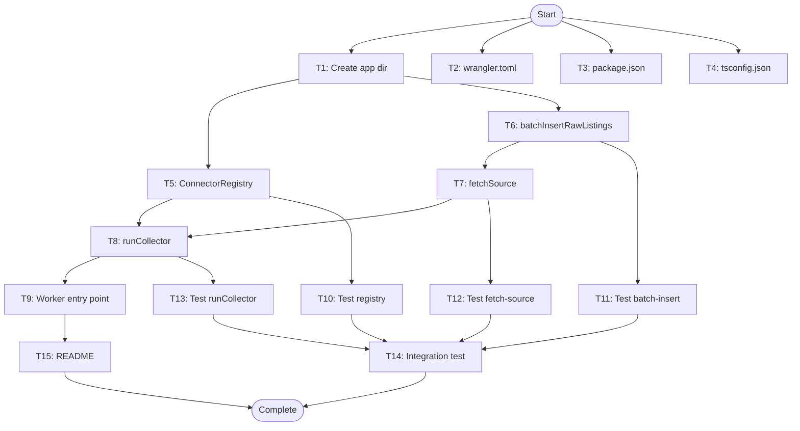

# Collector Worker - Task Breakdown

**Feature**: Collector Worker
**Spec**: `.specs/features/collector-worker/spec.md`
**Design**: `.specs/features/collector-worker/design.md`

---

## Task List

### T1: Create collector app directory structure [P]

**What**: Create `apps/collector/src/` directory for worker source files
**Where**: `apps/collector/src/`
**Depends on**: None
**Done when**:
- [ ] Directory exists at `apps/collector/src/`
- [ ] Directory is tracked in git
**Verify**: `ls -la apps/collector/src/`

---

### T2: Create wrangler.toml configuration [P]

**What**: Create `apps/collector/wrangler.toml` with cron triggers and D1 binding
**Where**: `apps/collector/wrangler.toml`
**Depends on**: None
**Done when**:
- [ ] File contains `name = "rentifier-collector"`
- [ ] File contains `main = "src/index.ts"`
- [ ] File contains `compatibility_date = "2024-01-01"` or later
- [ ] File contains `[triggers]` section with `crons = ["*/30 * * * *"]`
- [ ] File contains `[[d1_databases]]` section with `binding = "DB"`
- [ ] File contains `database_name = "rentifier-db"`
**Verify**: `wrangler config validate apps/collector/wrangler.toml`

---

### T3: Create package.json for collector app [P]

**What**: Create `apps/collector/package.json` with worker dependencies
**Where**: `apps/collector/package.json`
**Depends on**: None
**Done when**:
- [ ] Package name is `@rentifier/collector`
- [ ] Dependencies include `@rentifier/db`, `@rentifier/connectors`, `@rentifier/core`
- [ ] DevDependencies include `@cloudflare/workers-types`, `wrangler`, `typescript`, `vitest`
- [ ] Scripts include `dev`, `deploy`, `test`, `typecheck`
**Verify**: `npm install` in apps/collector succeeds

---

### T4: Create tsconfig.json for collector app [P]

**What**: Create TypeScript configuration for the collector worker
**Where**: `apps/collector/tsconfig.json`
**Depends on**: None
**Done when**:
- [ ] Extends base tsconfig if monorepo has one
- [ ] Include path covers `src/**/*`
- [ ] CompilerOptions target ES2022 or later
- [ ] Module is ESNext
- [ ] Types include `@cloudflare/workers-types`
- [ ] ModuleResolution is bundler or nodenext
**Verify**: `tsc --noEmit` in apps/collector succeeds

---

### T5: Create ConnectorRegistry class

**What**: Implement registry for mapping source names to connector instances
**Where**: `apps/collector/src/registry.ts`
**Depends on**: None
**Done when**:
- [ ] Class has private `connectors: Map<string, IConnector>` property
- [ ] Implements `register(name: string, connector: IConnector): void` method
- [ ] Implements `get(name: string): IConnector | undefined` method
- [ ] Implements `has(name: string): boolean` method
- [ ] Exports `createDefaultRegistry(): ConnectorRegistry` factory function
- [ ] Factory function returns empty registry (connectors registered later)
**Verify**: Unit test instantiates registry and calls all methods

---

### T6: Create batchInsertRawListings helper

**What**: Implement batch insert function for raw listings with 500-row batching
**Where**: `apps/collector/src/batch-insert.ts`
**Depends on**: None
**Done when**:
- [ ] Function signature: `batchInsertRawListings(db: D1Database, sourceId: number, candidates: ListingCandidate[]): Promise<number>`
- [ ] Constant `BATCH_SIZE = 500` defined
- [ ] Splits candidates array into batches of 500
- [ ] Builds multi-value INSERT INTO listings_raw query with placeholders
- [ ] Uses `ON CONFLICT IGNORE` pattern (inherits from schema)
- [ ] Returns total count of inserted rows (from `result.meta.changes`)
- [ ] Handles empty array gracefully (returns 0)
**Verify**: Unit test with 1200 mock candidates verifies 3 batches executed

---

### T7: Create fetchSource error-isolated handler

**What**: Implement per-source fetch logic with try-catch error boundary
**Where**: `apps/collector/src/fetch-source.ts`
**Depends on**: T6
**Done when**:
- [ ] Function signature: `fetchSource(db: D1Database, source: Source, connector: IConnector): Promise<FetchSourceResult>`
- [ ] Interface FetchSourceResult defined with sourceId, success, fetchedCount, nextCursor, error
- [ ] Gets current cursor from `getSourceState(db, source.id)`
- [ ] Calls `connector.fetchNew(cursor)`
- [ ] Calls `batchInsertRawListings(db, source.id, candidates)`
- [ ] On success: updates source_state with cursor, last_run_at, last_status='ok', last_error=null
- [ ] On failure: catches error, updates source_state with last_run_at, last_status='error', last_error=message
- [ ] Returns FetchSourceResult with success boolean and metadata
**Verify**: Unit test with mock failing connector verifies error captured and state updated

---

### T8: Create runCollector orchestration function

**What**: Implement main loop that processes all enabled sources sequentially
**Where**: `apps/collector/src/collector.ts`
**Depends on**: T5, T7
**Done when**:
- [ ] Function signature: `runCollector(db: D1Database): Promise<CollectorResult>`
- [ ] Interface CollectorResult defined with totalSources, successCount, errorCount, skippedCount, totalFetched, errors array
- [ ] Calls `createDefaultRegistry()` to get connector registry
- [ ] Calls `getEnabledSources(db)` to fetch source list
- [ ] Returns early with zero counts if no enabled sources
- [ ] Loops through sources sequentially (for...of loop)
- [ ] For each source: gets connector from registry or skips with warning
- [ ] For each source: wraps `fetchSource()` call in try-catch
- [ ] Aggregates results into CollectorResult object
- [ ] Logs structured result object before returning
**Verify**: Unit test with 3 mock sources (1 success, 1 error, 1 skipped) verifies counts correct

---

### T9: Create worker entry point

**What**: Implement Cloudflare Worker scheduled handler
**Where**: `apps/collector/src/index.ts`
**Depends on**: T8
**Done when**:
- [ ] Default export is object with `scheduled` method
- [ ] Scheduled method signature: `async scheduled(event: ScheduledEvent, env: Env, ctx: ExecutionContext): Promise<void>`
- [ ] Interface Env defined with `DB: D1Database` property
- [ ] Logs start timestamp
- [ ] Calls `runCollector(env.DB)` wrapped in try-catch
- [ ] Logs completion result or error
- [ ] Does not throw (allows worker to exit gracefully)
**Verify**: `wrangler dev` starts without errors, manual trigger succeeds

---

### T10: Create unit test for ConnectorRegistry

**What**: Write tests for registry register/get/has operations
**Where**: `apps/collector/src/registry.test.ts`
**Depends on**: T5
**Done when**:
- [ ] Test: register and retrieve connector by name
- [ ] Test: get returns undefined for unregistered name
- [ ] Test: has returns true for registered, false for unregistered
- [ ] Test: createDefaultRegistry returns empty registry
**Verify**: `npm test` in apps/collector passes

---

### T11: Create unit test for batchInsertRawListings

**What**: Write tests for batch splitting and SQL generation
**Where**: `apps/collector/src/batch-insert.test.ts`
**Depends on**: T6
**Done when**:
- [ ] Test: empty array returns 0
- [ ] Test: array < 500 generates single INSERT
- [ ] Test: array of 1200 generates 3 batch INSERTs
- [ ] Test: verifies ON CONFLICT IGNORE dedup (mock D1 meta.changes)
**Verify**: `npm test` in apps/collector passes

---

### T12: Create unit test for fetchSource

**What**: Write tests for error handling and state updates
**Where**: `apps/collector/src/fetch-source.test.ts`
**Depends on**: T7
**Done when**:
- [ ] Test: successful fetch updates cursor and status='ok'
- [ ] Test: failed fetch sets status='error' and last_error
- [ ] Test: both success and failure update last_run_at
- [ ] Test: zero candidates still updates state
- [ ] Mock connector returns predictable FetchResult
- [ ] Mock D1Database verifies updateSourceState called correctly
**Verify**: `npm test` in apps/collector passes

---

### T13: Create unit test for runCollector

**What**: Write tests for orchestration logic and aggregation
**Where**: `apps/collector/src/collector.test.ts`
**Depends on**: T8
**Done when**:
- [ ] Test: no enabled sources returns zero counts
- [ ] Test: skipped source (no connector) increments skippedCount
- [ ] Test: successful source increments successCount and totalFetched
- [ ] Test: failed source increments errorCount and populates errors array
- [ ] Test: mixed results aggregate correctly
- [ ] Mock getEnabledSources returns test data
- [ ] Mock registry returns connectors for some sources
**Verify**: `npm test` in apps/collector passes

---

### T14: Create integration test with local D1

**What**: Write end-to-end test using wrangler dev and local D1
**Where**: `apps/collector/src/integration.test.ts`
**Depends on**: T9
**Done when**:
- [ ] Test setup: creates local D1 database, applies migrations
- [ ] Test setup: inserts test source with enabled=true
- [ ] Test setup: registers mock connector in registry
- [ ] Test: triggers collector, verifies raw listings inserted
- [ ] Test: verifies source_state cursor advanced
- [ ] Test: runs collector twice, verifies idempotency (no duplicates)
- [ ] Test teardown: cleans up local D1
**Verify**: `npm test:integration` in apps/collector passes

---

### T15: Create README with deployment instructions

**What**: Document how to deploy and verify the collector worker
**Where**: `apps/collector/README.md`
**Depends on**: T9
**Done when**:
- [ ] Documents prerequisites (Wrangler CLI, D1 database created)
- [ ] Documents local development: `wrangler dev`
- [ ] Documents deployment: `wrangler deploy`
- [ ] Documents manual trigger for testing
- [ ] Documents how to verify: query listings_raw and source_state
- [ ] Documents cron schedule configuration
**Verify**: Follow README steps in new environment, collector deploys successfully

---

## Execution Plan

### Phase 1: Setup (Parallel)
Run T1, T2, T3, T4 in parallel — these are independent configuration tasks.

**Duration**: 5 minutes

---

### Phase 2: Core Components (Parallel)
Run T5, T6 in parallel — registry and batch insert are independent.

**Duration**: 15 minutes

---

### Phase 3: Integration Layer (Sequential)
Run T7 → T8 → T9 sequentially — each depends on the previous.

- T7: fetchSource (uses T6)
- T8: runCollector (uses T5, T7)
- T9: index.ts entry point (uses T8)

**Duration**: 20 minutes

---

### Phase 4: Testing (Parallel Batches)

**Batch 4A** (Unit tests, run in parallel):
- T10: registry.test.ts
- T11: batch-insert.test.ts
- T12: fetch-source.test.ts
- T13: collector.test.ts

**Batch 4B** (Integration test, run after 4A):
- T14: integration.test.ts

**Duration**: 25 minutes

---

### Phase 5: Documentation (Parallel)
Run T15 after T9 completes.

**Duration**: 10 minutes

---

**Total Estimated Duration**: 75 minutes

---

## Parallel Execution Map

**Parallelizable Tasks**: T1-T4 | T5, T6 | T10-T13

**Critical Path**: Start → T1 → T5 → T8 → T9 → T15 → End

**Maximum Parallel Workers**: 4 (Phase 1 or Phase 4A)

---

## Cross-Feature Dependencies

**IMPORTANT**: Collector worker depends on D1 schema being complete. The following must be done first:

1. D1 schema migrations applied (`wrangler d1 migrations apply`)
2. `@rentifier/db` package built and available
3. Query helpers from `@rentifier/db/queries` accessible

**Recommended Execution Order**:
1. Complete ALL D1 Schema tasks (T1-T17)
2. Verify migrations applied to local and remote D1
3. Begin Collector Worker tasks

This ensures the database layer is solid before building the worker that depends on it.
