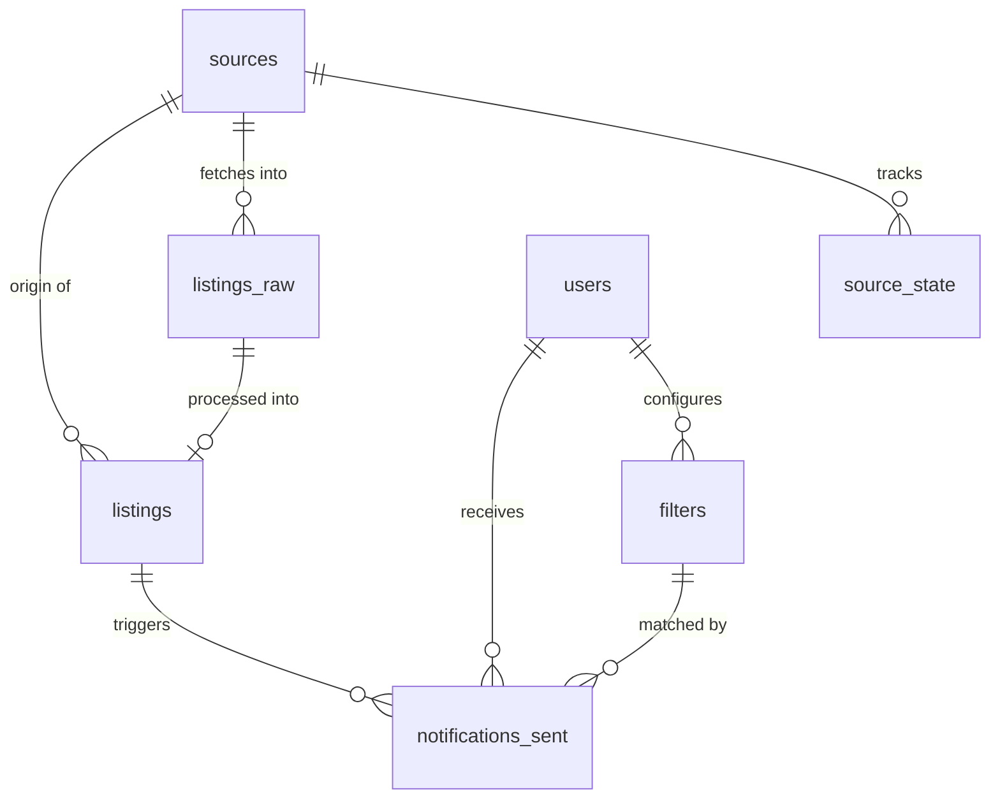

# D1 Database Schema Design

**Spec**: `.specs/features/d1-schema/spec.md`
**Status**: Draft

---

## Architecture Overview

The D1 schema serves as the single source of truth for all Rentifier data. It supports three primary workflows:

1. **Collection**: Collector worker stores raw payloads and tracks source cursors
2. **Processing**: Processor worker normalizes raw listings into canonical form
3. **Notification**: Notify worker matches listings against user filters and tracks sent notifications

All tables use SQLite's type affinity system. Foreign keys enforce referential integrity. Unique constraints and `ON CONFLICT` clauses ensure idempotent operations across all three workers.



---

## Code Reuse Analysis

Greenfield project — establishing patterns:

- **Migration numbering**: `0001_initial_schema.sql` format for sequential application
- **Idempotent upserts**: `ON CONFLICT DO UPDATE` for listings, `ON CONFLICT DO NOTHING` for notifications
- **Type safety**: Schema definitions will be exported as TypeScript types from `@rentifier/db`
- **Query helpers**: All workers will use typed query functions from `@rentifier/db` rather than raw SQL

---

## Components

### Migration Files

- **Purpose**: Define all tables, indexes, and constraints via Wrangler-managed migrations
- **Location**: `packages/db/migrations/`
- **Files**:
  - `0001_initial_schema.sql` - All core tables
  - `0002_indexes.sql` - Performance indexes for hot paths
- **Interfaces**: Applied via `wrangler d1 migrations apply rentifier-db`
- **Dependencies**: None (pure SQL)

### Schema Type Exports

- **Purpose**: TypeScript type definitions matching the SQL schema for compile-time safety
- **Location**: `packages/db/src/schema.ts`
- **Interfaces**:
  ```typescript
  export interface Source {
    id: number;
    name: string;
    enabled: boolean;
    created_at: string;
  }

  export interface SourceState {
    source_id: number;
    cursor: string | null;
    last_run_at: string | null;
    last_status: 'ok' | 'error' | null;
    last_error: string | null;
  }

  export interface ListingRaw {
    id: number;
    source_id: number;
    source_item_id: string;
    url: string;
    raw_json: string;
    fetched_at: string;
  }

  export interface Listing {
    id: number;
    source_id: number;
    source_item_id: string;
    title: string;
    description: string | null;
    price: number | null;
    currency: string | null;
    price_period: string | null;
    bedrooms: number | null;
    city: string | null;
    neighborhood: string | null;
    area_text: string | null;
    url: string;
    posted_at: string | null;
    ingested_at: string;
    tags_json: string | null;
    relevance_score: number | null;
  }

  export interface User {
    id: number;
    telegram_chat_id: string;
    display_name: string;
    created_at: string;
  }

  export interface Filter {
    id: number;
    user_id: number;
    name: string;
    min_price: number | null;
    max_price: number | null;
    min_bedrooms: number | null;
    max_bedrooms: number | null;
    cities_json: string | null;
    neighborhoods_json: string | null;
    keywords_json: string | null;
    must_have_tags_json: string | null;
    exclude_tags_json: string | null;
    enabled: boolean;
    created_at: string;
  }

  export interface NotificationSent {
    user_id: number;
    listing_id: number;
    filter_id: number | null;
    sent_at: string;
    channel: string;
  }
  ```
- **Dependencies**: None

### Query Helpers

- **Purpose**: Typed database access functions wrapping common operations
- **Location**: `packages/db/src/queries.ts`
- **Interfaces**:
  ```typescript
  // Collector operations
  export function getEnabledSources(db: D1Database): Promise<Source[]>;
  export function getSourceState(db: D1Database, sourceId: number): Promise<SourceState | null>;
  export function updateSourceState(db: D1Database, sourceId: number, state: Partial<SourceState>): Promise<void>;
  export function insertRawListings(db: D1Database, listings: Omit<ListingRaw, 'id' | 'fetched_at'>[]): Promise<void>;

  // Processor operations
  export function getUnprocessedRawListings(db: D1Database, limit: number): Promise<ListingRaw[]>;
  export function upsertListing(db: D1Database, listing: Omit<Listing, 'id' | 'ingested_at'>): Promise<number>;

  // Notify operations
  export function getNewListingsSince(db: D1Database, since: string): Promise<Listing[]>;
  export function getActiveFilters(db: D1Database): Promise<(Filter & { user: User })[]>;
  export function getUserById(db: D1Database, userId: number): Promise<User | null>;
  export function checkNotificationSent(db: D1Database, userId: number, listingId: number): Promise<boolean>;
  export function recordNotificationSent(db: D1Database, userId: number, listingId: number, filterId: number | null, channel: string): Promise<void>;
  ```
- **Dependencies**: D1Database type from `@cloudflare/workers-types`

---

## Data Models

### Complete SQL DDL

#### Migration 0001: Initial Schema

```sql
-- sources: configuration for each data source connector
CREATE TABLE sources (
  id INTEGER PRIMARY KEY AUTOINCREMENT,
  name TEXT NOT NULL UNIQUE,
  enabled BOOLEAN NOT NULL DEFAULT 1,
  created_at TEXT NOT NULL DEFAULT (datetime('now'))
);

-- source_state: cursor tracking and status for each source
CREATE TABLE source_state (
  source_id INTEGER PRIMARY KEY,
  cursor TEXT,
  last_run_at TEXT,
  last_status TEXT CHECK(last_status IN ('ok', 'error')),
  last_error TEXT,
  FOREIGN KEY (source_id) REFERENCES sources(id) ON DELETE CASCADE
);

-- listings_raw: original unprocessed payloads from sources
CREATE TABLE listings_raw (
  id INTEGER PRIMARY KEY AUTOINCREMENT,
  source_id INTEGER NOT NULL,
  source_item_id TEXT NOT NULL,
  url TEXT NOT NULL,
  raw_json TEXT NOT NULL,
  fetched_at TEXT NOT NULL DEFAULT (datetime('now')),
  UNIQUE(source_id, source_item_id) ON CONFLICT IGNORE,
  FOREIGN KEY (source_id) REFERENCES sources(id) ON DELETE CASCADE
);

-- listings: canonical normalized listing data
CREATE TABLE listings (
  id INTEGER PRIMARY KEY AUTOINCREMENT,
  source_id INTEGER NOT NULL,
  source_item_id TEXT NOT NULL,
  title TEXT NOT NULL,
  description TEXT,
  price REAL,
  currency TEXT,
  price_period TEXT,
  bedrooms INTEGER,
  city TEXT,
  neighborhood TEXT,
  area_text TEXT,
  url TEXT NOT NULL,
  posted_at TEXT,
  ingested_at TEXT NOT NULL DEFAULT (datetime('now')),
  tags_json TEXT,
  relevance_score REAL,
  UNIQUE(source_id, source_item_id) ON CONFLICT DO UPDATE SET
    title = excluded.title,
    description = excluded.description,
    price = excluded.price,
    currency = excluded.currency,
    price_period = excluded.price_period,
    bedrooms = excluded.bedrooms,
    city = excluded.city,
    neighborhood = excluded.neighborhood,
    area_text = excluded.area_text,
    url = excluded.url,
    posted_at = excluded.posted_at,
    tags_json = excluded.tags_json,
    relevance_score = excluded.relevance_score,
  FOREIGN KEY (source_id) REFERENCES sources(id) ON DELETE CASCADE
);

-- users: Telegram user accounts
CREATE TABLE users (
  id INTEGER PRIMARY KEY AUTOINCREMENT,
  telegram_chat_id TEXT NOT NULL UNIQUE,
  display_name TEXT NOT NULL,
  created_at TEXT NOT NULL DEFAULT (datetime('now'))
);

-- filters: user-defined listing match criteria
CREATE TABLE filters (
  id INTEGER PRIMARY KEY AUTOINCREMENT,
  user_id INTEGER NOT NULL,
  name TEXT NOT NULL,
  min_price REAL,
  max_price REAL,
  min_bedrooms INTEGER,
  max_bedrooms INTEGER,
  cities_json TEXT,
  neighborhoods_json TEXT,
  keywords_json TEXT,
  must_have_tags_json TEXT,
  exclude_tags_json TEXT,
  enabled BOOLEAN NOT NULL DEFAULT 1,
  created_at TEXT NOT NULL DEFAULT (datetime('now')),
  FOREIGN KEY (user_id) REFERENCES users(id) ON DELETE CASCADE
);

-- notifications_sent: deduplication tracking for sent notifications
CREATE TABLE notifications_sent (
  user_id INTEGER NOT NULL,
  listing_id INTEGER NOT NULL,
  filter_id INTEGER,
  sent_at TEXT NOT NULL DEFAULT (datetime('now')),
  channel TEXT NOT NULL DEFAULT 'telegram',
  PRIMARY KEY (user_id, listing_id),
  FOREIGN KEY (user_id) REFERENCES users(id) ON DELETE CASCADE,
  FOREIGN KEY (listing_id) REFERENCES listings(id) ON DELETE CASCADE,
  FOREIGN KEY (filter_id) REFERENCES filters(id) ON DELETE SET NULL
);
```

#### Migration 0002: Performance Indexes

```sql
-- Index for finding unprocessed raw listings (anti-join pattern)
CREATE INDEX idx_listings_raw_source_item ON listings_raw(source_id, source_item_id);

-- Index for querying new listings by ingestion time
CREATE INDEX idx_listings_ingested_at ON listings(ingested_at DESC);

-- Index for filter queries by user
CREATE INDEX idx_filters_user_enabled ON filters(user_id, enabled);

-- Index for notification dedup lookups
CREATE INDEX idx_notifications_user_listing ON notifications_sent(user_id, listing_id);

-- Index for querying listings by city (common filter)
CREATE INDEX idx_listings_city ON listings(city) WHERE city IS NOT NULL;

-- Index for querying listings by price (common filter)
CREATE INDEX idx_listings_price ON listings(price) WHERE price IS NOT NULL;
```

---

## Error Handling Strategy

| Scenario | Handling | Recovery |
|----------|----------|----------|
| Duplicate source name insert | `UNIQUE` constraint violation | Caught by D1, return error to caller |
| Duplicate raw listing insert | `ON CONFLICT IGNORE` | Silent skip, no error |
| Duplicate canonical listing insert | `ON CONFLICT DO UPDATE` | Update existing row with new values |
| Duplicate notification insert | `PRIMARY KEY` constraint violation | Silent skip via `INSERT OR IGNORE` pattern |
| Invalid `last_status` value | `CHECK` constraint violation | Caught by D1, return error to caller |
| Foreign key violation (orphaned state) | `FOREIGN KEY` constraint with `ON DELETE CASCADE` | Cascading delete cleans up dependent rows |
| NULL in non-nullable column | SQLite type affinity + schema enforcement | Caught by D1, return error to caller |
| JSON parse error in `*_json` columns | Not enforced at DB level | Handled in application layer via Zod validation |

---

## Tech Decisions

| Decision | Rationale | Trade-off |
|----------|-----------|-----------|
| TEXT for all timestamps | SQLite datetime functions work with ISO8601 strings | No native TIMESTAMP type; must format correctly |
| JSON columns as TEXT | D1/SQLite has limited JSON query support; M1 uses simple parsing | Cannot index into JSON fields efficiently; full-text search deferred |
| `ON CONFLICT IGNORE` for raw listings | Idempotent collector runs; duplicate fetches are no-ops | Cannot update existing raw payloads if source data changes |
| `ON CONFLICT DO UPDATE` for canonical listings | Processor can re-run and update stale data (e.g., price changes) | Always overwrites; no merge logic or version tracking |
| Composite PK on notifications_sent | Natural dedup: one notification per (user, listing) pair | Cannot track multiple sends if needed later; `sent_at` not part of PK |
| AUTOINCREMENT on all ID columns | Guarantees monotonic IDs even after deletes | Slight performance cost vs. non-AUTOINCREMENT |
| No full-text search indexes | Deferred to M2; LIKE queries sufficient for M1 keyword matching | Slower keyword searches; cannot use FTS5 ranking |
| Foreign keys with CASCADE | Deleting a source cleans up all dependent rows automatically | Cannot soft-delete sources without manual cleanup |
| Single D1 database for all workers | Simpler deployment; all workers share binding name `DB` | No logical separation; must manage schema evolution carefully |

---

## Hot Path Query Patterns

### 1. Unprocessed Raw Listings (Processor)

```sql
SELECT lr.*
FROM listings_raw lr
LEFT JOIN listings l ON lr.source_id = l.source_id
  AND lr.source_item_id = l.source_item_id
WHERE l.id IS NULL
LIMIT ?;
```

**Index usage**: `idx_listings_raw_source_item` + `listings(source_id, source_item_id)` UNIQUE

### 2. New Listings Since Timestamp (Notify)

```sql
SELECT *
FROM listings
WHERE ingested_at > ?
ORDER BY ingested_at DESC;
```

**Index usage**: `idx_listings_ingested_at`

### 3. Unsent Notifications for User (Notify)

```sql
SELECT l.*
FROM listings l
CROSS JOIN filters f
LEFT JOIN notifications_sent ns
  ON ns.user_id = f.user_id AND ns.listing_id = l.id
WHERE f.user_id = ?
  AND f.enabled = 1
  AND ns.sent_at IS NULL
  AND (f.min_price IS NULL OR l.price >= f.min_price)
  AND (f.max_price IS NULL OR l.price <= f.max_price)
  -- ... additional filter criteria
LIMIT ?;
```

**Index usage**: `idx_filters_user_enabled`, `idx_notifications_user_listing`, `idx_listings_price`

---

## Migration Application

**Canonical location**: `packages/db/migrations/` is the single source of truth for all migration files. Workers reference this path via the `migrations_dir` setting in their `wrangler.toml`. No migration files should exist outside this directory.

Migrations are applied via:

```bash
# Create the database (once)
wrangler d1 create rentifier-db

# Apply all pending migrations
wrangler d1 migrations apply rentifier-db

# Verify schema
wrangler d1 execute rentifier-db --command "SELECT name FROM sqlite_master WHERE type='table';"
```

Each migration file is numbered sequentially (`0001_`, `0002_`, etc.). Wrangler tracks applied migrations and skips already-applied files, ensuring idempotent deployment.

---

## Validation and Testing

### Schema Validation

- `wrangler d1 migrations apply` must complete without errors
- `PRAGMA foreign_key_check;` must return zero rows
- `PRAGMA integrity_check;` must return `ok`

### Idempotency Testing

- Insert the same raw listing twice → verify single row exists
- Upsert the same canonical listing twice with different price → verify price updated
- Insert the same notification twice → verify single row exists

### Query Plan Verification

```sql
EXPLAIN QUERY PLAN SELECT ...
```

Must show `USING INDEX` for all hot-path queries, never `SCAN TABLE`.

---

## Future Considerations

- **Full-text search**: Add FTS5 virtual table on `listings(title, description)` in M2
- **Geo-spatial indexes**: Add R-Tree index if map-based filtering is added
- **Audit logging**: Optional `jobs` table for tracking worker runs and errors
- **Data archival**: Partition strategy for old listings (e.g., move to separate archive table after 90 days)
- **Schema versioning**: Track migration history in a dedicated table if Wrangler's tracking is insufficient
