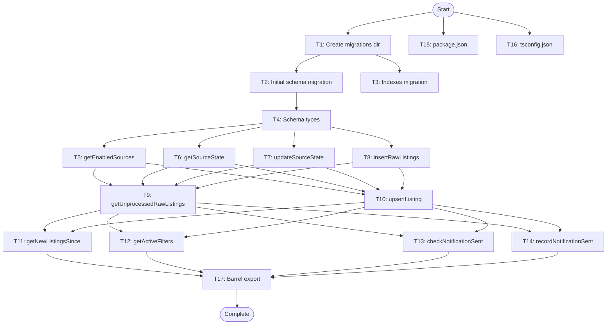

# D1 Database Schema - Task Breakdown

**Feature**: D1 Database Schema
**Spec**: `.specs/features/d1-schema/spec.md`
**Design**: `.specs/features/d1-schema/design.md`

---

## Task List

### T1: Create migration directory structure [P]

**What**: Create `packages/db/migrations/` directory for SQL migration files
**Where**: `packages/db/migrations/`
**Depends on**: None
**Done when**:
- [ ] Directory exists at `packages/db/migrations/`
- [ ] Directory is tracked in git
**Verify**: `ls -la packages/db/migrations/`

---

### T2: Create initial schema migration file [P]

**What**: Create `0001_initial_schema.sql` with all core tables (sources, source_state, listings_raw, listings, users, filters, notifications_sent)
**Where**: `packages/db/migrations/0001_initial_schema.sql`
**Depends on**: T1
**Done when**:
- [ ] File contains CREATE TABLE for sources with AUTOINCREMENT id, name UNIQUE, enabled BOOLEAN, created_at TEXT
- [ ] File contains CREATE TABLE for source_state with foreign key to sources(id) ON DELETE CASCADE
- [ ] File contains CREATE TABLE for listings_raw with UNIQUE(source_id, source_item_id) ON CONFLICT IGNORE
- [ ] File contains CREATE TABLE for listings with UNIQUE(source_id, source_item_id) ON CONFLICT DO UPDATE
- [ ] File contains CREATE TABLE for users with telegram_chat_id UNIQUE
- [ ] File contains CREATE TABLE for filters with foreign key to users(id) ON DELETE CASCADE
- [ ] File contains CREATE TABLE for notifications_sent with PRIMARY KEY(user_id, listing_id)
- [ ] All TEXT timestamp columns use DEFAULT (datetime('now'))
- [ ] All CHECK constraints are valid (e.g., last_status IN ('ok', 'error'))
**Verify**: `wrangler d1 migrations list rentifier-db` shows 0001_initial_schema.sql

---

### T3: Create indexes migration file [P]

**What**: Create `0002_indexes.sql` with performance indexes for hot-path queries
**Where**: `packages/db/migrations/0002_indexes.sql`
**Depends on**: T1
**Done when**:
- [ ] File contains CREATE INDEX idx_listings_raw_source_item ON listings_raw(source_id, source_item_id)
- [ ] File contains CREATE INDEX idx_listings_ingested_at ON listings(ingested_at DESC)
- [ ] File contains CREATE INDEX idx_filters_user_enabled ON filters(user_id, enabled)
- [ ] File contains CREATE INDEX idx_notifications_user_listing ON notifications_sent(user_id, listing_id)
- [ ] File contains CREATE INDEX idx_listings_city ON listings(city) WHERE city IS NOT NULL
- [ ] File contains CREATE INDEX idx_listings_price ON listings(price) WHERE price IS NOT NULL
**Verify**: `wrangler d1 migrations list rentifier-db` shows 0002_indexes.sql

---

### T4: Create schema TypeScript types file

**What**: Create `packages/db/src/schema.ts` exporting TypeScript interfaces matching SQL schema
**Where**: `packages/db/src/schema.ts`
**Depends on**: T2
**Done when**:
- [ ] Exports interface Source with id, name, enabled, created_at
- [ ] Exports interface SourceState with source_id, cursor, last_run_at, last_status, last_error
- [ ] Exports interface ListingRaw with id, source_id, source_item_id, url, raw_json, fetched_at
- [ ] Exports interface Listing with all 17 fields from design
- [ ] Exports interface User with id, telegram_chat_id, display_name, created_at
- [ ] Exports interface Filter with all 13 fields from design
- [ ] Exports interface NotificationSent with user_id, listing_id, filter_id, sent_at, channel
- [ ] All nullable fields use `| null` type annotation
- [ ] All timestamp fields use `string` type
**Verify**: `tsc --noEmit packages/db/src/schema.ts`

---

### T5: Create getEnabledSources query helper

**What**: Implement `getEnabledSources(db: D1Database): Promise<Source[]>` query function
**Where**: `packages/db/src/queries.ts`
**Depends on**: T4
**Done when**:
- [ ] Function executes `SELECT * FROM sources WHERE enabled = 1`
- [ ] Returns array of Source objects
- [ ] Handles empty result gracefully
**Verify**: Unit test mocking D1Database returns Source[] type

---

### T6: Create getSourceState query helper

**What**: Implement `getSourceState(db: D1Database, sourceId: number): Promise<SourceState | null>` query function
**Where**: `packages/db/src/queries.ts`
**Depends on**: T4
**Done when**:
- [ ] Function executes `SELECT * FROM source_state WHERE source_id = ?`
- [ ] Returns SourceState object or null if not found
- [ ] Binds sourceId parameter correctly
**Verify**: Unit test mocking D1Database returns SourceState | null type

---

### T7: Create updateSourceState query helper

**What**: Implement `updateSourceState(db: D1Database, sourceId: number, state: Partial<SourceState>): Promise<void>` query function
**Where**: `packages/db/src/queries.ts`
**Depends on**: T4
**Done when**:
- [ ] Function builds UPDATE source_state SET ... WHERE source_id = ? query
- [ ] Only updates fields present in the `state` parameter
- [ ] Handles cursor, last_run_at, last_status, last_error fields
- [ ] Uses INSERT OR REPLACE if row doesn't exist
**Verify**: Unit test mocking D1Database verifies SQL statement

---

### T8: Create insertRawListings query helper

**What**: Implement `insertRawListings(db: D1Database, listings: Omit<ListingRaw, 'id' | 'fetched_at'>[]): Promise<void>` query function
**Where**: `packages/db/src/queries.ts`
**Depends on**: T4
**Done when**:
- [ ] Function builds batch INSERT INTO listings_raw (...) VALUES (...) query
- [ ] Relies on UNIQUE constraint ON CONFLICT IGNORE for dedup
- [ ] Accepts array of listings and constructs multi-value INSERT
- [ ] Handles empty array gracefully (no-op)
**Verify**: Unit test mocking D1Database verifies batch SQL statement

---

### T9: Create getUnprocessedRawListings query helper

**What**: Implement `getUnprocessedRawListings(db: D1Database, limit: number): Promise<ListingRaw[]>` query function
**Where**: `packages/db/src/queries.ts`
**Depends on**: T4
**Done when**:
- [ ] Function executes anti-join query: `SELECT lr.* FROM listings_raw lr LEFT JOIN listings l ON lr.source_id = l.source_id AND lr.source_item_id = l.source_item_id WHERE l.id IS NULL LIMIT ?`
- [ ] Returns array of ListingRaw objects
- [ ] Binds limit parameter correctly
**Verify**: Unit test mocking D1Database returns ListingRaw[] type

---

### T10: Create upsertListing query helper

**What**: Implement `upsertListing(db: D1Database, listing: Omit<Listing, 'id' | 'ingested_at'>): Promise<number>` query function
**Where**: `packages/db/src/queries.ts`
**Depends on**: T4
**Done when**:
- [ ] Function builds INSERT INTO listings (...) VALUES (...) ON CONFLICT DO UPDATE query
- [ ] Returns the inserted or updated listing ID
- [ ] Handles all 15 listing fields from Omit type
- [ ] Uses RETURNING id clause to get the row ID
**Verify**: Unit test mocking D1Database verifies ON CONFLICT DO UPDATE clause

---

### T11: Create getNewListingsSince query helper

**What**: Implement `getNewListingsSince(db: D1Database, since: string): Promise<Listing[]>` query function
**Where**: `packages/db/src/queries.ts`
**Depends on**: T4
**Done when**:
- [ ] Function executes `SELECT * FROM listings WHERE ingested_at > ? ORDER BY ingested_at DESC`
- [ ] Returns array of Listing objects
- [ ] Binds since parameter correctly
**Verify**: Unit test mocking D1Database returns Listing[] type

---

### T12: Create getActiveFilters query helper

**What**: Implement `getActiveFilters(db: D1Database): Promise<(Filter & { user: User })[]>` query function
**Where**: `packages/db/src/queries.ts`
**Depends on**: T4
**Done when**:
- [ ] Function executes `SELECT f.*, u.* FROM filters f JOIN users u ON f.user_id = u.id WHERE f.enabled = 1`
- [ ] Returns array of objects combining Filter and User data
- [ ] Maps joined columns correctly to nested user object
**Verify**: Unit test mocking D1Database returns array with user property

---

### T13: Create checkNotificationSent query helper

**What**: Implement `checkNotificationSent(db: D1Database, userId: number, listingId: number): Promise<boolean>` query function
**Where**: `packages/db/src/queries.ts`
**Depends on**: T4
**Done when**:
- [ ] Function executes `SELECT 1 FROM notifications_sent WHERE user_id = ? AND listing_id = ? LIMIT 1`
- [ ] Returns true if row exists, false otherwise
- [ ] Binds userId and listingId parameters correctly
**Verify**: Unit test mocking D1Database returns boolean type

---

### T14: Create recordNotificationSent query helper

**What**: Implement `recordNotificationSent(db: D1Database, userId: number, listingId: number, filterId: number | null, channel: string): Promise<void>` query function
**Where**: `packages/db/src/queries.ts`
**Depends on**: T4
**Done when**:
- [ ] Function executes `INSERT OR IGNORE INTO notifications_sent (user_id, listing_id, filter_id, channel) VALUES (?, ?, ?, ?)`
- [ ] Handles duplicate inserts gracefully via PRIMARY KEY constraint
- [ ] Binds all four parameters correctly
**Verify**: Unit test mocking D1Database verifies INSERT OR IGNORE statement

---

### T15: Create package.json for @rentifier/db

**What**: Create `packages/db/package.json` with dependencies and exports configuration
**Where**: `packages/db/package.json`
**Depends on**: None
**Done when**:
- [ ] Package name is `@rentifier/db`
- [ ] Exports `./schema`, `./queries` paths
- [ ] Dependencies include `@cloudflare/workers-types`
- [ ] DevDependencies include `typescript`, `vitest`
- [ ] Scripts include `build`, `test`, `typecheck`
**Verify**: `npm install` in packages/db succeeds

---

### T16: Create tsconfig.json for @rentifier/db

**What**: Create TypeScript configuration for the db package
**Where**: `packages/db/tsconfig.json`
**Depends on**: None
**Done when**:
- [ ] Extends base tsconfig if monorepo has one
- [ ] Include path covers `src/**/*`
- [ ] CompilerOptions target ES2022 or later
- [ ] Module is ESNext or NodeNext
- [ ] Types include `@cloudflare/workers-types`
**Verify**: `tsc --noEmit` in packages/db succeeds

---

### T17: Create index.ts barrel export

**What**: Create `packages/db/src/index.ts` re-exporting schema and queries
**Where**: `packages/db/src/index.ts`
**Depends on**: T4, T5-T14
**Done when**:
- [ ] Exports all interfaces from `./schema`
- [ ] Exports all query functions from `./queries`
- [ ] File compiles without errors
**Verify**: `import { Source, getEnabledSources } from '@rentifier/db'` works in consuming package

---

## Execution Plan

### Phase 1: Setup (Parallel)
Run T1, T15, T16 in parallel — these are independent configuration tasks.

**Duration**: 5 minutes

---

### Phase 2: Schema Definition (Sequential)
Run T2, T3 sequentially — T3 references tables from T2.

**Duration**: 15 minutes

---

### Phase 3: Type Definitions (Sequential)
Run T4 after T2 — TypeScript types must match SQL schema.

**Duration**: 10 minutes

---

### Phase 4: Query Helpers (Parallel Batches)

**Batch 4A** (Collector queries, run in parallel):
- T5: getEnabledSources
- T6: getSourceState
- T7: updateSourceState
- T8: insertRawListings

**Batch 4B** (Processor queries, run in parallel after 4A):
- T9: getUnprocessedRawListings
- T10: upsertListing

**Batch 4C** (Notify queries, run in parallel after 4B):
- T11: getNewListingsSince
- T12: getActiveFilters
- T13: checkNotificationSent
- T14: recordNotificationSent

**Duration**: 30 minutes (batches run sequentially, tasks within each batch parallel)

---

### Phase 5: Integration (Sequential)
Run T17 after all query helpers complete.

**Duration**: 5 minutes

---

**Total Estimated Duration**: 65 minutes

---

## Parallel Execution Map

**Parallelizable Tasks**: T1, T15, T16 | T5-T8 | T9-T10 | T11-T14

**Critical Path**: Start → T1 → T2 → T4 → T5 → T9 → T11 → T17 → End

**Maximum Parallel Workers**: 4 (Phase 4A or 4C)
