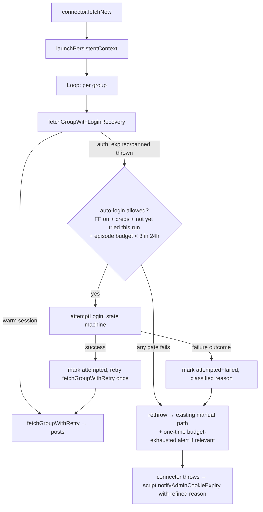

# Facebook Auto-Login Design

**Spec**: `.specs/features/facebook-auto-login/spec.md`
**Status**: Draft

---

## Architecture Overview

Auto-login is implemented as a **bounded state-machine login flow** invoked **only on first auth failure** during a normal scrape run. It is a strictly **reactive recovery layer** wrapped around the existing `fetchGroupWithRetry` call — the happy path (warm session) is unchanged.



The login state machine handles the various screens Facebook may serve when a partially-expired session is asked to re-authenticate. Because `.browser-profiles` is **persistent and partially-populated** (we may still hold `c_user` even when `xs` is invalid), we are NOT always landing on the empty `/login` form — we may land on the saved-account "Continue as [Name]" screen, the password-only re-entry screen, or directly on the home feed (false positive on auth detection). The flow handles all four.

---

## Login State Machine

After the connector calls `attemptLogin(page, credentials, accountId)`, the function navigates to `https://www.facebook.com/` (or stays on the page that triggered the auth error) and enters a **classify → act → re-classify** loop, bounded by `MAX_LOGIN_STEPS = 5`.

### Screen states (discriminated by DOM probe, in priority order)

| State                       | Detection                                                                                                 | Action                                                                                              | Next expected state                          |
|-----------------------------|-----------------------------------------------------------------------------------------------------------|-----------------------------------------------------------------------------------------------------|---------------------------------------------|
| `home_feed`                 | URL is `/` or `/feed/`, AND `[role="feed"]` or `[aria-label*="Facebook"]` present, AND no `#login_form`    | None — we're already in.                                                                            | **terminal: success**                       |
| `checkpoint`                | URL contains `/checkpoint/` OR matches `/recover/`/`/disabled/`                                            | None — never auto-bypass.                                                                           | **terminal: failure (reason=`checkpoint`)** |
| `captcha`                   | `[name="captcha_response"]`, `iframe[src*="captcha"]`, `[id^="captcha"]`, or any `img[src*="captcha"]`     | None — never auto-solve.                                                                            | **terminal: failure (reason=`captcha`)**    |
| `two_factor`                | `input[name="approvals_code"]` OR URL contains `two_step_verification`/`checkpoint/?next` with TOTP form  | None — out of scope per spec.                                                                       | **terminal: failure (reason=`two_factor`)** |
| `continue_as_user` (saved)  | A `[role="button"]` whose **accessible name** starts with one of a known-locale "continue" word list followed by a name (see CONTINUE_LOCALES below). Detected via Playwright's `page.getByRole('button', { name: CONTINUE_RE })`. The button has no stable `data-testid`/`id`/`name` — verified against a real DOM snapshot 2026-05-26: only `aria-label="<Continue> <UserName>"` and an inner `<span>` with the localized "Continue" word are reliable hooks. Selector probe order: (1) role+accessible-name; (2) `[role="button"]` containing a `<span>` whose text exactly matches a CONTINUE_LOCALES entry; (3) URL-based fallback — `a[role="button"][href*="login_redirect"]` if Facebook ever switches the saved-account UI back to anchor links. | Click the matched button. Wait for navigation. | `home_feed` (success) OR `password_only` (Facebook re-challenged) |
| `password_only`             | `input[name="pass"]` present AND `input[name="email"]` is missing OR readonly OR pre-filled-and-disabled  | Type `password`, click submit.                                                                      | `home_feed` OR `invalid_credentials` re-render |
| `full_login`                | `input[name="email"]` AND `input[name="pass"]` AND `button[name="login"]` (or `button[type="submit"]` inside `#login_form`) | Type `email`, type `password`, click submit.                                                        | `home_feed` OR `invalid_credentials` re-render |
| `invalid_credentials`       | Same as `full_login`/`password_only` AFTER a submit, AND error banner present: `[data-testid="royal_login_error"]`, `#error_box`, or `[role="alert"]` with text matching known error fragments | None — credentials wrong.                                                                           | **terminal: failure (reason=`invalid_credentials`)** |
| `save_login_prompt`         | URL is `/save-device/` or page contains `[role="dialog"]` with "Save your login info?" / "Not now"        | Click "Not now" (safer — don't pollute persistent profile with a confirm we don't understand).      | `home_feed` (or whatever screen follows)    |
| `cookie_consent`            | Banner with `[data-testid="cookie-policy-manage-dialog"]` or button text "Allow all" / "Decline optional" | Click "Decline optional" if present, else "Allow all" — both unblock; pick the safer.               | re-classify same URL                         |
| `unknown`                   | None of the above match                                                                                   | None.                                                                                               | **terminal: failure (reason=`unknown_login_page`)** |

### Loop guarantees

- **Step cap (`MAX_LOGIN_STEPS = 5`)** — prevents loops on adversarial states. If `home_feed` not reached within 5 transitions, exit with `unknown_login_page`.
- **No-progress detection** — if classification returns the same non-terminal state twice in a row, exit with `unknown_login_page` (don't re-click the same button).
- **Never click anything inside `cookie_consent` more than once** — cookie banner is idempotent; if it doesn't go away after one click, it's a layout change → `unknown_login_page`.
- **Page-level navigation is awaited** — every click that triggers navigation uses `Promise.all([page.waitForLoadState('domcontentloaded'), button.click()])` with a 15s timeout. A timeout exits with reason `timeout` (mapped to existing `network` errorType so `script.collect-facebook.ts` classifies it correctly).

### Outcome shape

```typescript
type LoginOutcome =
  | { success: true }
  | {
      success: false
      reason:
        | 'invalid_credentials'
        | 'checkpoint'
        | 'captcha'
        | 'two_factor'
        | 'unknown_login_page'
        | 'timeout'
    }
```

---

## Code Reuse Analysis

### Existing Components to Leverage

| Component                                   | Location                                                  | How to Use                                                                                  |
|---------------------------------------------|-----------------------------------------------------------|---------------------------------------------------------------------------------------------|
| `launchPersistentContext`                   | `packages/connectors/src/facebook/client.ts:68`           | Unchanged. Auto-login operates inside the same persistent context, so successful re-auth is automatically persisted to `.browser-profiles/fb-account-N` for subsequent runs. |
| `detectAuthFailure`                         | `packages/connectors/src/facebook/client.ts:180`          | Reused as the trigger. We do NOT add a parallel detector.                                   |
| `clearProfile`                              | `packages/connectors/src/facebook/client.ts:136`          | Called by the connector on terminal failure (existing behavior); not called on auto-login *success* — that would erase the freshly-stored cookies. |
| `FacebookClientError` + `FacebookErrorType` | `packages/connectors/src/facebook/client.ts:38-55`        | Extended with new errorType values? **No** — keep `errorType` ∈ {`network`, `auth_expired`, `rate_limited`, `banned`, `parse`, `timeout`}. Login outcome reasons are surfaced separately via the connector's structured logs and pass through to `notifyAdminCookieExpiry` as a new optional parameter. |
| `notifyAdminCookieExpiry` (script-level)    | `scripts/collect-facebook.ts:78`                          | Extend signature to accept an optional `loginOutcome?: LoginOutcome` so the alert text can be specialized per the spec's P2 ACs. Backward compatible. |
| `fetchGroupWithRetry`                       | `packages/connectors/src/facebook/client.ts:512`          | Unchanged. The recovery wrapper is built around it.                                          |
| Round-robin account state (`disabledAccounts`, `lastAccountIndex`) | `packages/connectors/src/facebook/index.ts:78` (`selectAccount`) | When auto-login succeeds for account N, do NOT add N to `disabledAccounts`. When it fails, behave as today (push to `disabledAccounts`). |

### Integration Points

| System                   | Integration Method                                                                                       |
|--------------------------|----------------------------------------------------------------------------------------------------------|
| GitHub Actions workflow  | New env passthroughs for `FB_AUTO_LOGIN_ENABLED`, `FB_EMAIL`, `FB_PASSWORD`, `FB_EMAIL_1..N`, `FB_PASSWORD_1..N`. No new steps. |
| Existing Telegram alert  | Specialized message text per `LoginOutcome.reason` (Spec P2). Existing send logic untouched.             |
| Existing `.browser-profiles` cache | Refreshed cookies live in the same persistent context dir → next run benefits with no extra plumbing. |

---

## Components

### `FacebookCredentials` (loader)

- **Purpose**: Read username/password env vars per account, with shared-fallback semantics, returning a typed credential or `null`.
- **Location**: `packages/connectors/src/facebook/credentials.ts` (new file)
- **Interfaces**:
  - `loadCredentials(accountId: string): { email: string; password: string } | null` — Returns `null` if either email or password is empty for this account (per spec edge case).
  - `isAutoLoginEnabled(): boolean` — Returns `process.env.FB_AUTO_LOGIN_ENABLED === 'true'`. Single source of truth for the flag.
- **Dependencies**: `process.env` only. Pure function — easy to unit test by stubbing `process.env`.
- **Reuses**: Same single-account-fallback shape as `getAccounts` in `accounts.ts` (account-scoped wins; shared name with no `_N` suffix is fallback only when no account-scoped is set AND only one account is configured).

### `attemptLogin` (state-machine driver)

- **Purpose**: Drive the bounded login flow on an existing Playwright `Page`, returning a structured outcome.
- **Location**: `packages/connectors/src/facebook/login.ts` (new file)
- **Interfaces**:
  - `attemptLogin(page: Page, creds: { email: string; password: string }, opts?: { maxSteps?: number; timeoutMs?: number }): Promise<LoginOutcome>`
  - `classifyLoginScreen(page: Page): Promise<LoginScreenState>` — exported for unit testing with mocked Page.
- **Dependencies**: `playwright` (`Page`), constants for selectors and timeouts.
- **Reuses**: Same logging style as `client.ts` (`console.log(JSON.stringify({ event: 'fb_login_*', ... }))`); does NOT log credentials (Spec P1 AC #7).

### `fetchGroupWithLoginRecovery` (connector wrapper)

- **Purpose**: Single hook into `fetchGroupWithRetry` that injects one auto-login attempt across all groups in a run (not per group), bounded by both a per-run guard AND a persistent global budget.
- **Location**: `packages/connectors/src/facebook/index.ts` (added inline; the connector class owns the per-run guard and reads/writes the persistent budget on the cursor).
- **Interfaces** (as a private method on `FacebookConnector`):
  - `private async fetchGroupWithLoginRecovery(page, groupId, accountId, state): Promise<FacebookPost[]>`
  - **Per-run guard**: `private loginAttempted = new Set<string>()` — instance field. Connector is instantiated fresh per script invocation, so the Set lives exactly one cron tick (Spec P1 AC #6).
  - **Persistent budget**: read/written on `FacebookCursorState.loginAttempts` (see Data Models). Decision tree before calling `attemptLogin`:
    1. Is `FB_AUTO_LOGIN_ENABLED` true? If no → skip.
    2. Are credentials present for this account? If no → skip.
    3. Is account in the per-run `loginAttempted` Set? If yes → skip.
    4. Read `state.loginAttempts[accountId]`. If `count >= MAX_LOGIN_ATTEMPTS_PER_EPISODE` AND `now < firstAttemptAt + LOGIN_EPISODE_WINDOW_MS` → skip with reason `budget_exhausted` (logged + a single Telegram alert if not previously alerted for this episode).
    5. Otherwise, attempt login. On success, **clear** `state.loginAttempts[accountId]`. On failure, increment `count`, set `lastAttemptAt`, and (if first failure of episode) set `firstAttemptAt`.
- **Dependencies**: `attemptLogin`, `loadCredentials`, `isAutoLoginEnabled`.
- **Reuses**: All existing connector cursor-state and error-classification logic — only the call site for `fetchGroupWithRetry` changes.

### `notifyAdminCookieExpiry` (script-level, extended)

- **Purpose**: Send the right Telegram message based on auto-login outcome.
- **Location**: `scripts/collect-facebook.ts` (existing function, signature extension)
- **Interfaces**:
  - `notifyAdminCookieExpiry(accountId: string, errorType: string, loginOutcome?: LoginOutcome): Promise<void>` — when `loginOutcome.success === false`, message text is selected from a small map keyed by `loginOutcome.reason`. When omitted, current message is used (backward compat).
- **Dependencies**: existing fetch + env vars.
- **Reuses**: existing send logic; only the message string is conditional.

---

## Data Models

No DB schema changes. New data is in-memory + a small additive change to the existing JSON-encoded cursor state.

### Cursor state extension

```typescript
// packages/connectors/src/facebook/types.ts (additive — backward compatible)
interface FacebookCursorState {
  // ... existing fields
  /**
   * Per-account login attempt budget. Survives across cron runs.
   * Key = accountId. Cleared on first successful login.
   * An "episode" is the window from the first failed login attempt;
   * once the window elapses, the slot is treated as fresh.
   */
  loginAttempts?: Record<string, {
    count: number
    firstAttemptAt: string  // ISO 8601
    lastAttemptAt: string   // ISO 8601
    lastReason?: LoginOutcome extends { success: false; reason: infer R } ? R : never
    /** Set true after we've sent the "budget_exhausted" Telegram alert for this episode, so we don't spam it on every cron tick. */
    budgetAlertSent?: boolean
  }>
}
```

`parseCursorState` in `index.ts` already tolerates missing fields (returns defaults via `createDefaultCursorState`); the new optional field is purely additive — old cursors deserialize fine and the connector lazily initializes `loginAttempts = {}` on first write.

### New constants

```typescript
// packages/connectors/src/facebook/login.ts
const LOGIN_TIMEOUT_MS = 15_000
const LOGIN_NAVIGATION_TIMEOUT_MS = 15_000
const MAX_LOGIN_STEPS = 5

/**
 * Hard cap on login attempts per account per episode.
 * 3 = generous enough to absorb transient flakiness (timeout, layout glitch),
 *     tight enough to never look like a brute-force pattern to Facebook.
 */
const MAX_LOGIN_ATTEMPTS_PER_EPISODE = 3

/**
 * After this window, the attempt counter resets — a fresh expiration is
 * treated as a new episode and gets its own 3-attempt budget.
 * 24h = if creds are wrong, the operator has had a full day to fix them
 *       and we resume trying. Long enough that we don't pile up retries
 *       hour-after-hour while a checkpoint is unresolved.
 */
const LOGIN_EPISODE_WINDOW_MS = 24 * 60 * 60 * 1000

const SELECTORS = {
  email: 'input[name="email"]',
  password: 'input[name="pass"]',
  submit: 'button[name="login"], #login_form button[type="submit"]',
  loginErrorBanner: '[data-testid="royal_login_error"], #error_box, [role="alert"]',
  feed: '[role="feed"]',
  checkpointUrlFragments: ['/checkpoint/', '/recover/', '/disabled/'],
  twoFactorInput: 'input[name="approvals_code"]',
  captcha: '[name="captcha_response"], iframe[src*="captcha"], [id^="captcha"]',
  saveLoginDialogNotNow: '[role="dialog"] [aria-label="Not now"], [role="dialog"] [aria-label="Not Now"]',
  cookieConsentDecline: '[data-testid="cookie-policy-manage-dialog-decline-button"]',
  cookieConsentAccept: '[data-testid="cookie-policy-manage-dialog-accept-button"]',
  // continue_as_user — no stable id/data-testid; locator built dynamically (see below)
} as const

/**
 * Localized "Continue" words used in Facebook's saved-account screen accessible name.
 * Matched against the START of the button's accessible name (which is "<Continue> <DisplayName>").
 * Order matters only marginally — the first locale to match wins.
 *
 * Anchor with \b to avoid matching "Continue Without Login" if Facebook ever ships such a button.
 * Followed by `\s+\S+` to require at least one space + name token after the verb (so we don't
 * accidentally click a generic "Continue" button on an unrelated dialog).
 */
const CONTINUE_LOCALES = [
  'Continue',     // en
  'המשך',         // he
  'Continuar',    // es / pt
  'Continuer',    // fr
  'Weiter',       // de
  'Продолжить',   // ru
  '继续',          // zh-CN
  '繼續',          // zh-TW
  '続ける',        // ja
  '계속',          // ko
] as const

const CONTINUE_RE = new RegExp(
  `^(?:${CONTINUE_LOCALES.map((w) => w.replace(/[.*+?^${}()|[\]\\]/g, '\\$&')).join('|')})\\b\\s+\\S+`,
)

/**
 * Locator factory for the Continue-as-user button. Tried in order until one matches.
 * Each strategy is independent — if Facebook changes one layer, the others may still hit.
 */
function continueAsLocators(page: Page): Locator[] {
  return [
    // 1) Accessible-name match via role — most resilient to class hash churn.
    page.getByRole('button', { name: CONTINUE_RE }),
    // 2) role="button" containing a <span> whose text exactly matches a locale word.
    //    Catches cases where the aria-label is missing/different but the visible text is still there.
    page.locator('div[role="button"]').filter({
      has: page.locator('span', {
        hasText: new RegExp(`^(?:${CONTINUE_LOCALES.join('|')})$`),
      }),
    }),
    // 3) Anchor-style fallback — if Facebook reverts to a link-based saved-account UI.
    page.locator('a[role="button"][href*="login_redirect"]'),
  ]
}
```

---

## Error Handling Strategy

| Error Scenario                                              | Handling                                                                                         | User Impact                                                  |
|-------------------------------------------------------------|--------------------------------------------------------------------------------------------------|--------------------------------------------------------------|
| `FB_AUTO_LOGIN_ENABLED` is not `"true"`                     | Skip `attemptLogin` entirely; rethrow original `auth_expired` (today's path).                    | Telegram alert: today's text. No regression.                |
| Credentials missing for account N (and no shared fallback)  | Skip `attemptLogin`; log `fb_login_skip_no_credentials`; rethrow.                                | Telegram alert: today's text. Operator sees skip log.        |
| Login already attempted this run for this account           | Skip `attemptLogin`; rethrow.                                                                     | Avoids retry-storm. Telegram alert (if first failure already alerted, don't double-send: `notifyAdminCookieExpiry` is idempotent per (accountId, runId) via the existing `disabledAccounts` cursor delta detection in the script). |
| Persistent budget exhausted (3 failed login attempts in 24h for account N) | Skip `attemptLogin`; rethrow original auth_expired error. Send a one-time Telegram alert per episode: "FB account #N: auto-login budget exhausted (3 failed attempts). Backing off for 24h. Resolve the underlying cause (credentials / checkpoint / layout) before counter resets." Set `state.loginAttempts[N].budgetAlertSent = true` so the alert isn't repeated every cron tick. | Operator gets one clear alert that we've stopped trying. Account remains in `disabledAccounts`. After 24h, counter resets and auto-login resumes naturally — or operator manually clears state earlier. |
| Successful login after prior failures in same episode       | Clear `state.loginAttempts[N]` entirely.                                                          | Episode is over — counter resets so a future expiration starts fresh.                                                                                                                                                            |
| Login outcome = `invalid_credentials`                       | Mark attempted; rethrow original error; pass outcome to `notifyAdminCookieExpiry`.               | Specialized Telegram message: "credentials rejected. Update FB_PASSWORD_N." |
| Login outcome = `checkpoint` / `captcha` / `two_factor`     | Same as above; specialized message.                                                              | Specialized Telegram message per spec P2.                    |
| Login outcome = `unknown_login_page`                        | Same as above; message includes hint to inspect run logs.                                        | Specialized Telegram message.                                |
| Login outcome = `timeout`                                   | Treat as `network` errorType (transient); log + rethrow original.                                | No specialized alert; this can happen on flaky GitHub runners. Next cron tick retries fresh. |
| Playwright crashes during login (e.g., page closed)         | Caught and converted to `LoginOutcome` of reason `timeout`; alert.                              | Operator sees `unknown_login_page` or `timeout` and can inspect logs. |
| Auto-login succeeds, but the next group navigation immediately re-detects `auth_expired` | Per-run guard prevents a second login attempt; rethrow normally; account added to `disabledAccounts`. | One alert. No infinite loop. (Spec edge case explicitly covered.) |

---

## Tech Decisions (only non-obvious ones)

| Decision                                                                                  | Choice                                                                                                                              | Rationale                                                                                                                                                          |
|-------------------------------------------------------------------------------------------|--------------------------------------------------------------------------------------------------------------------------------------|--------------------------------------------------------------------------------------------------------------------------------------------------------------------|
| Where to call `attemptLogin` from                                                         | Inside a connector-level wrapper around the per-group loop — NOT inside `fetchGroupWithRetry`                                       | Keeps `client.ts` pure (no env-var reads, no credential loader). The connector already owns account-scoped state; it's the natural home for the per-run guard.   |
| Detect "auth failure that should trigger login" via                                       | Reuse `detectAuthFailure` thrown as `FacebookClientError` with `errorType ∈ {auth_expired, banned}` — same trigger as today's manual flow | Zero new detection code. Same trigger means we cover all the cases the operator currently reacts to manually.                                                      |
| Should `banned` (`/checkpoint/` URL) attempt login?                                       | Yes, attempt — but the state machine will short-circuit on `checkpoint` state and exit cleanly with `reason=checkpoint`             | Saves a code path. The state machine is the right place to decide "we can't recover this" — not the trigger code.                                                  |
| State machine vs. linear "if URL is X, click Y"                                           | State machine                                                                                                                        | Multiple paths converge on `home_feed` from different starting screens (full login, password-only, continue-as). Linear code becomes a tangle. State machine = one authoritative classifier + per-state handlers. Easy to test each handler independently. |
| Selector strategy: `name`/`id`-based vs. visible-text-based                               | `name`/`id`-based with text-based fallback only for `Continue`/`Not now` dialogs                                                    | Spec edge case: locale changes. `name="email"` and `name="pass"` are stable across Facebook locales; visible labels are not.                                       |
| Should we add a TOTP code path?                                                            | No (spec out-of-scope), but the `two_factor` state IS detected and exits with `reason=two_factor`                                  | Detection is cheap and gives a precise alert if Facebook unilaterally enforces 2FA later. Wiring the actual TOTP submit is a future feature.                       |
| When auto-login succeeds, do we update `disabledAccounts` cursor state?                   | No — only failure adds to `disabledAccounts`. Success means we never threw → cursor logic is identical to today's "session was warm" branch. | Avoids double-bookkeeping. Per-run `Set` is the only new state.                                                                                                    |
| Should we run a pre-flight navigation to `https://www.facebook.com/` before the first group? | No                                                                                                                                   | Adds latency on the 99% happy-path runs. Recovery is reactive: only when the first group navigation throws auth_expired do we attempt login. No wasted work.       |
| Idempotency of the Telegram alert                                                          | Rely on existing `cursor.disabledAccounts` delta detection in `scripts/collect-facebook.ts` — only NEWLY disabled accounts trigger an alert | Already implemented (`scripts/collect-facebook.ts:194`). Auto-login that fails ends the same way (account is added to `disabledAccounts`), so existing dedup applies for free. |
| Two-layer attempt cap: per-run guard + persistent per-episode budget                        | Both. Per-run = `Set<accountId>` in connector instance (1 attempt per cron tick). Per-episode = persistent counter in cursor state (3 attempts per 24h window, regardless of run). | Per-run alone is **insufficient**: a 30-min cron over 24h is 48 runs. With wrong creds, that's 48 failed login submissions/day per account — exactly Facebook's "too many failed logins → permanent lock" trigger. Per-episode alone is **awkward**: it would still permit 3 attempts on a single run if the connector retried internally. Both layers together = at most 1 attempt per run *and* at most 3 per 24h, which is safely below Facebook's anti-abuse heuristics while still recovering from genuine transient failures. |
| Episode window length                                                                       | 24h sliding from `firstAttemptAt`                                                                                                  | Long enough for the operator to notice the alert and fix creds. Short enough that a once-flaky day doesn't permanently disable an account. Counter resets ⇒ a fresh expiration after 24h gets the full 3-attempt budget again. |
| Episode counter reset trigger                                                                | Successful login (`LoginOutcome.success === true`)                                                                                  | Episode is defined as "the period of consecutive failed logins". Success ends it. The next failure starts a brand-new episode with fresh budget. |

---

## Workflow YAML Diff (illustrative)

```diff
       env:
         CF_ACCOUNT_ID: ${{ secrets.CF_ACCOUNT_ID }}
         CF_API_TOKEN: ${{ secrets.CF_API_TOKEN }}
         CF_D1_DATABASE_ID: ${{ secrets.CF_D1_DATABASE_ID }}
         FB_ACCOUNT_COUNT: ${{ secrets.FB_ACCOUNT_COUNT }}
         FB_COOKIES_1: ${{ secrets.FB_COOKIES_1 }}
         FB_COOKIES_2: ${{ secrets.FB_COOKIES_2 }}
+        FB_AUTO_LOGIN_ENABLED: ${{ secrets.FB_AUTO_LOGIN_ENABLED }}
+        FB_EMAIL_1: ${{ secrets.FB_EMAIL_1 }}
+        FB_PASSWORD_1: ${{ secrets.FB_PASSWORD_1 }}
+        FB_EMAIL_2: ${{ secrets.FB_EMAIL_2 }}
+        FB_PASSWORD_2: ${{ secrets.FB_PASSWORD_2 }}
         TELEGRAM_BOT_TOKEN: ${{ secrets.TELEGRAM_BOT_TOKEN }}
         TELEGRAM_ADMIN_CHAT_ID: ${{ secrets.TELEGRAM_ADMIN_CHAT_ID }}
```

Operator runbook addition (DEPLOYMENT.md): after creating the new secrets, set `FB_AUTO_LOGIN_ENABLED=true` last, so auto-login activates only once credentials are in place.

---

## Test Strategy

### Unit tests (Vitest, mock `Page`)

1. **`credentials.ts`** — env-var loading: per-account, shared fallback, missing-half cases, FF off/on.
2. **`login.ts: classifyLoginScreen`** — feed `Page` mocks (with `url()` and `$()` stubs) returning each fixture: home_feed, full_login, password_only, continue_as_user, checkpoint, captcha, two_factor, save_login_prompt, cookie_consent, unknown.
3. **`login.ts: attemptLogin`** — script the classifier to walk known happy paths (full_login → home_feed) and known failure paths (full_login → invalid_credentials, full_login → checkpoint, no-progress loop → unknown).
4. **`index.ts` connector wrapper** — mock `attemptLogin` and assert: only one call per run per account; not called when FF off; not called when creds missing; rethrows original error on failure; succeeds and re-fetches on success.
5. **Budget enforcement** — table-driven cursor-state cases:
   - `loginAttempts` empty → attempt allowed, counter set to 1 with `firstAttemptAt = now`.
   - `count = 1, firstAttemptAt = 1h ago` → attempt allowed, counter incremented to 2.
   - `count = 3, firstAttemptAt = 2h ago` → attempt SKIPPED with reason `budget_exhausted`; if `budgetAlertSent` is false, alert sent + flag flipped; if true, no alert.
   - `count = 3, firstAttemptAt = 25h ago` → window elapsed, counter RESET to 1, attempt allowed.
   - Success after `count = 2` → `loginAttempts[N]` deleted entirely.
5. **`scripts/collect-facebook.ts: notifyAdminCookieExpiry`** — message text per `loginOutcome.reason`.

### Integration / smoke (manual, gated)

- `pnpm exec tsx scripts/collect-facebook.ts --local` with `FB_AUTO_LOGIN_ENABLED=true`, valid creds, and a deliberately-cleared profile dir → expect login + scrape success. Log inspection: zero credential leaks.
- Same with deliberately-wrong password → expect specialized Telegram alert + no scrape.

### Negative — credential leakage

- Add a test that asserts the structured logger never emits the configured email/password verbatim. Run a `JSON.stringify` capture during the unit test for `attemptLogin` and assert no field contains either secret.

---

## Open Questions for Implementation Phase

These are NOT blockers — they're discoveries the implementer makes when the live page is inspected:

1. The `continue_as_user` locator strategy is grounded in a real DOM snapshot (2026-05-26, Hebrew locale): a `<div role="button" aria-label="<Continue> <DisplayName>">` with no stable `id`/`name`/`data-testid`. Implementer should run one local Playwright session **with `locale: 'en-US'`** (matching the runner config in `client.ts:96`) to verify the English-locale aria-label format is identical (`"Continue <DisplayName>"`) before relying on `CONTINUE_RE`. If Facebook ever drops the aria-label, locator (2) — visible-span text match — is the backstop; if both break, the state machine exits with `unknown_login_page` and the operator is alerted to investigate.
2. Whether `save_login_prompt` actually appears on a Linux headless Chromium with `userAgent: 'Mac Chrome'` is unknown. If never observed, the handler stays in code (no harm) and the test is a fixture-only test.
3. Cookie-consent banner: GitHub-hosted runners are US-IP, so EU consent banner is unlikely. Selector + handler stays as defense-in-depth; tested only via fixture.
