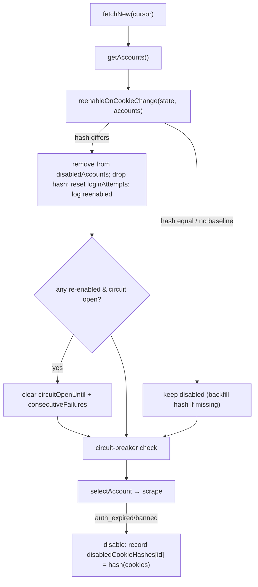

# Facebook Disabled-Account Auto Re-Enable Design

**Spec**: `.specs/features/facebook-disabled-account-auto-reenable/spec.md`
**Status**: Approved

---

## Architecture Overview

A disabled account is re-evaluated at the very start of `fetchNew`, before the circuit-breaker gate and account selection. We persist, per disabled account, the SHA-256 of the seed cookie string in effect when it was disabled (`disabledCookieHashes` in the cursor). Each run compares that against the hash of the account's *current* cookies (from `getAccounts`). A mismatch = operator refreshed the secret = re-enable.



The hash is recorded on the **disable** path (where `clearProfile` already runs) and read on the **re-enable** path. Because `clearProfile` deletes the in-profile `.rentifier-seed-cookie-sha256` file, the cursor is the only durable home for this baseline — hence storing it in `disabledCookieHashes` rather than reusing the profile file.

---

## Code Reuse Analysis

| Component | Location | How to Use |
| --------- | -------- | ---------- |
| `hashSeedCookies()` | currently private in `client.ts` | Extract to a new tiny `cookie-hash.ts` (no Playwright/fs deps) so both `client.ts` and `index.ts` import it, and so unit tests using a mocked `client` still get the real hash |
| `getAccounts()` | `accounts.ts` | Already returns `{ id, cookies }[]` — source of the current cookie string for hashing |
| `disabledAccounts` + disable block | `index.ts` (~330) | Add hash recording alongside the existing `clearProfile` call |
| Circuit-breaker fields | `index.ts` (~239) | Clear `circuitOpenUntil`/`consecutiveFailures` when a re-enable happens |

### Why a new `cookie-hash.ts`

`connector.test.ts` and `login-recovery.test.ts` both `vi.mock('../client')` and `vi.mock('../accounts')`. Importing the hash from either would force the mocks to stub it. A dedicated `cookie-hash.ts` (unmocked) keeps the real implementation available everywhere and removes the duplicate hash logic from `client.ts`.

---

## Components

### `cookie-hash.ts` (new)

- **Purpose**: Pure SHA-256 of the trimmed cookie string.
- **Interface**: `hashSeedCookies(seedCookies: string): string`
- **Dependencies**: `node:crypto` (already a connector dependency via `client.ts`).
- **Reuses**: replaces the private copy in `client.ts`.

### `FacebookConnector.reenableOnCookieChange` (new private method)

- **Purpose**: Mutate `state` to re-enable any disabled account whose cookies changed; backfill missing baselines.
- **Location**: `packages/connectors/src/facebook/index.ts`
- **Interface**: `reenableOnCookieChange(state: FacebookCursorState, accounts: FacebookAccount[]): string[]` → returns ids re-enabled.
- **Behavior**: per spec AC #2/#3/#5; emits `fb_account_reenabled` per id.

### `fetchNew` (modify)

- Call `getAccounts` once near the top; run `reenableOnCookieChange`; if it returned any ids and `circuitOpenUntil` is set, clear circuit state. Then proceed to existing circuit check + `selectAccount(accounts, state)` (reusing the already-fetched `accounts`).
- On disable: set `state.disabledCookieHashes[id] = hashSeedCookies(selected.account.cookies)`.
- Include `disabledCookieHashes` in the persisted `updatedState`.

---

## Data Models

```typescript
interface FacebookCursorState {
  // ...existing fields...
  disabledAccounts: string[];
  /** SHA-256 of the seed cookies captured when each account was disabled; a change auto re-enables it. */
  disabledCookieHashes?: Record<string, string>;
  loginAttempts?: Record<string, LoginAttemptRecord>;
}
```

Additive + optional → backward compatible with existing persisted cursors.

---

## Error Handling Strategy

| Scenario | Handling | Impact |
| -------- | -------- | ------ |
| Disabled id missing from `getAccounts` (secret removed) | Skip; keep disabled + keep hash entry | Account stays off until secret returns |
| Cookies changed but new session also dead | Re-enabled, attempted, re-disabled with the *new* hash | One disable/run + circuit breaker prevent loops |
| No baseline hash (legacy disable) | Backfill current hash, stay disabled | First subsequent change is detectable |

---

## Tech Decisions

| Decision | Choice | Rationale |
| -------- | ------ | --------- |
| Recovery trigger | Cookie-secret change only | Operator's existing fix flow; unambiguous, no hammering |
| Baseline storage | Cursor `disabledCookieHashes` | `clearProfile` wipes the in-profile hash file on disable |
| Legacy disables (no baseline) | Backfill + stay disabled | Avoid a one-time mass re-enable on deploy; require a real change |
| Clear circuit on re-enable | Yes, only if ≥1 re-enabled | Operator intervened; don't make them wait out the circuit window |
| Time-based fallback | Excluded | Out of scope; ban risk |
