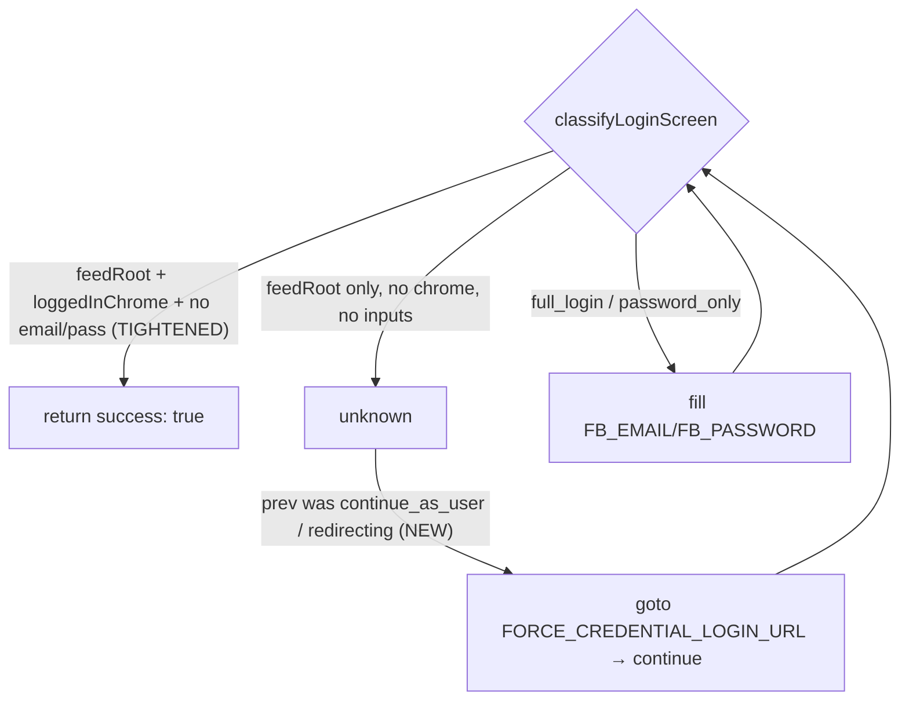
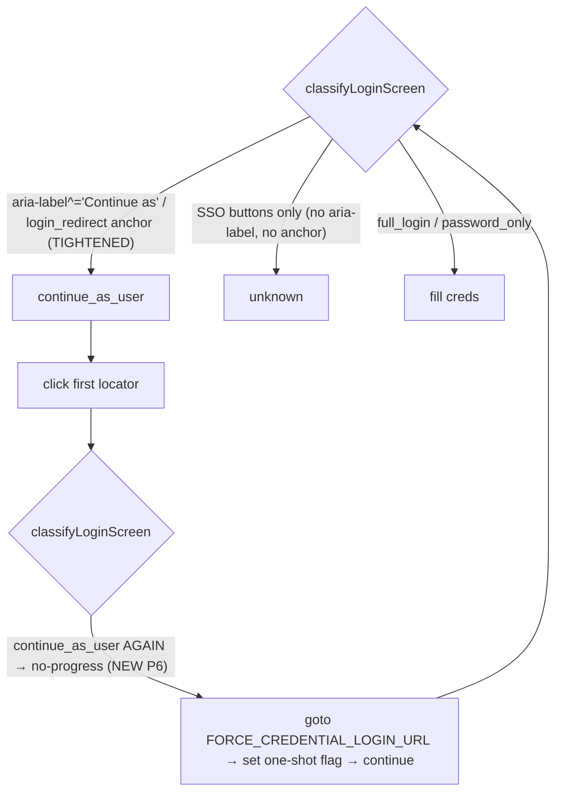
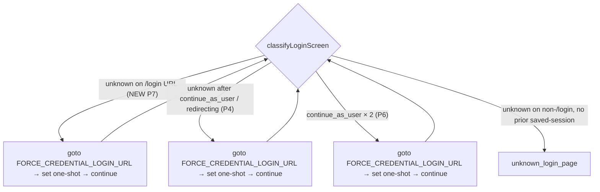
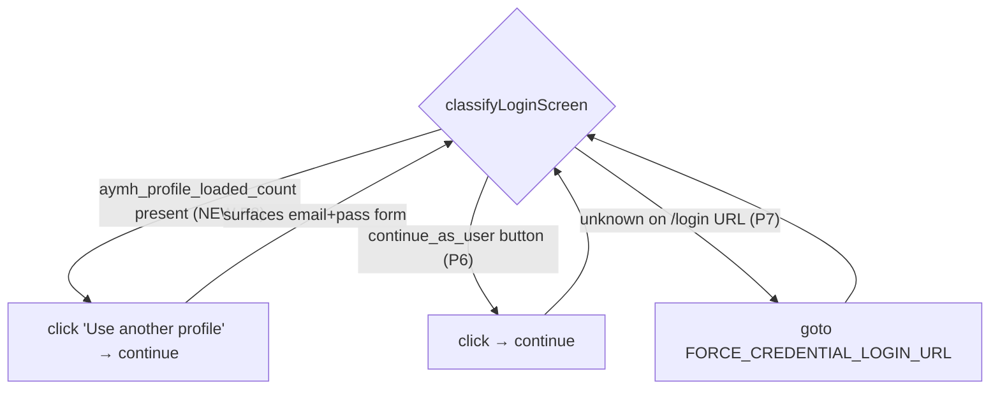
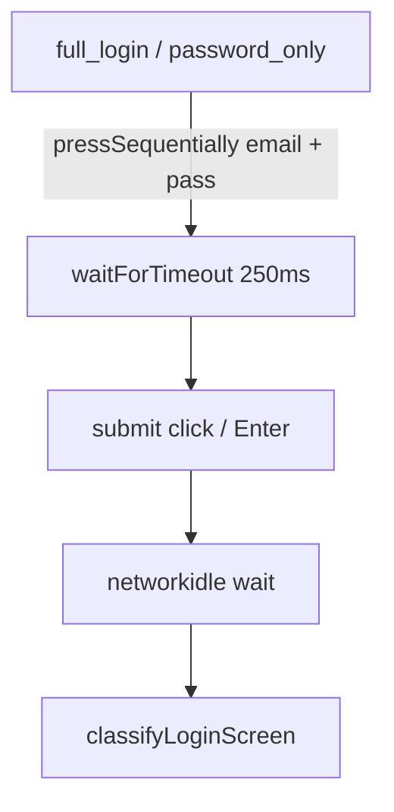

# Facebook Login Recovery Hardening Design

**Spec**: `.specs/features/facebook-login-recovery-hardening/spec.md`
**Status**: Approved

---

## Architecture Overview

The fix lives entirely in the login state machine (`login.ts`). No connector, cursor, DB, or env changes. We introduce one new transient state — `redirecting` — that represents Facebook's one-time login-redirect interstitial (`/?crypted_string=...&next=...`). `classifyLoginScreen()` returns it instead of falsely matching `home_feed`; `attemptLogin()` handles it by *actively* waiting for the redirect to resolve, then re-classifies on the next step. Once the interstitial settles, a truly-expired session renders the logged-out homepage (which carries `input[name="email"]`/`input[name="pass"]`), so the existing `full_login`/`password_only` handlers take over and type the real credentials.

```mermaid
graph TD
    A["auth_expired detected (connector)"] --> B["attemptLogin loop"]
    B --> C{classifyLoginScreen}
    C -->|continue_as_user| D["click 'Continue as'"]
    D --> C
    C -->|"url has crypted_string (NEW)"| R["redirecting: wait for redirect to settle"]
    R --> C
    C -->|full_login / password_only| E["fill FB_EMAIL/FB_PASSWORD"]
    E --> C
    C -->|home_feed (no crypted_string)| S["return success: true"]
    C -->|checkpoint/captcha/2fa/invalid| F["return success: false (reason)"]
    C -->|unknown / no-progress| G["return success: false: unknown_login_page"]
```

**Before (bug):** the `crypted_string` interstitial matched `home_feed` (priority 1: not `/login` + `[role=main]` + no email field yet rendered) → premature `success: true` → credential step skipped.
**After:** the interstitial is `redirecting` → waited out → resolves to the logged-out homepage → `full_login` → credentials entered → real `home_feed`.

---

## Code Reuse Analysis

### Existing Components to Leverage

| Component | Location | How to Use |
| --------- | -------- | ---------- |
| `classifyLoginScreen()` | `packages/connectors/src/facebook/login.ts` | Add interstitial detection as a new top-priority branch; everything else unchanged |
| `attemptLogin()` step loop | `packages/connectors/src/facebook/login.ts` | Add a handler arm for the `redirecting` state; reuse existing no-progress guard for loop safety |
| `LoginScreenState` union | `packages/connectors/src/facebook/login.ts` | Extend with `'redirecting'` |
| `LOGIN_NAVIGATION_TIMEOUT_MS` | `packages/connectors/src/facebook/login.ts` | Reuse as the settle timeout for `waitForURL` |
| `withNavigation()` / `page.waitForLoadState` patterns | `login.ts` | Same XHR/networkidle waiting style for the redirect settle |
| No-progress guard (`prevState === state`) | `attemptLogin()` | Already caps repeated states → guarantees `redirecting` can't loop forever |

### Integration Points

| System | Integration Method |
| ------ | ------------------ |
| `FacebookConnector.fetchGroupWithLoginRecovery` (`index.ts`) | Unchanged — still calls `attemptLogin`, still re-fetches the group to verify, still enforces one-attempt-per-run + disable-on-failure |
| `LoginOutcome` / `LoginFailureReason` (`types.ts`) | Unchanged — no new outcome reasons; `redirecting` is internal to the state machine, never surfaced as an outcome |

---

## Components

### `classifyLoginScreen()` (modify)

- **Purpose**: Add a new highest-priority branch that recognizes the login-redirect interstitial so it is never confused with the home feed.
- **Location**: `packages/connectors/src/facebook/login.ts`
- **Interfaces**:
  - `classifyLoginScreen(page: Page): Promise<LoginScreenState>` — now may return `'redirecting'`.
- **Behavior change**:
  - NEW Priority 0: if `url` contains `crypted_string=` (login-redirect token) → return `'redirecting'`.
  - Priority 1 `home_feed` unchanged otherwise (genuine home URL + feed/main + no email input still returns `home_feed`).
- **Dependencies**: `page.url()` only (pure/stateless — keeps it unit-testable).
- **Reuses**: existing priority-ladder structure.

### `attemptLogin()` (modify)

- **Purpose**: Treat `redirecting` as a non-terminal "wait and re-check" step instead of failing or succeeding.
- **Location**: `packages/connectors/src/facebook/login.ts`
- **Interfaces**: `attemptLogin(page, creds, opts?): Promise<LoginOutcome>` — signature unchanged.
- **Behavior change** — new arm before the generic `unknown` fallthrough:
  - `if (state === 'redirecting')`: actively wait for the redirect to leave the interstitial:
    `await page.waitForURL((u) => !u.toString().includes('crypted_string'), { timeout: LOGIN_NAVIGATION_TIMEOUT_MS }).catch(() => undefined);`
    then, as a deterministic fallback if still stuck, `await page.goto('https://www.facebook.com/', { waitUntil: 'domcontentloaded' }).catch(() => undefined);` then `continue` (re-classify next step).
  - The existing no-progress guard (`prevState === state`) ensures that if `redirecting` recurs with no resolution, the loop bails with `unknown_login_page` (AC P1#4 / P2#4) — no infinite loop.
- **Dependencies**: Playwright `page.waitForURL`, `page.goto`.
- **Reuses**: existing `continue` step semantics, no-progress guard, step/time budget.

### Tests (add)

- **`__tests__/login-classify.test.ts`**: add `redirecting` cases (crypted_string URL with/without `[role=main]`), assert genuine `HOME_URL` still `home_feed`.
- **`__tests__/login-attempt.test.ts`**: add a scripted-sequence test proving `continue_as_user → redirecting → full_login → home_feed` fills credentials and returns `{ success: true }`; add a `redirecting → redirecting` no-progress test returning `unknown_login_page`.

---

## Data Models

No data-model changes. `LoginScreenState` gains one literal:

```typescript
export type LoginScreenState =
  | 'home_feed'
  | 'checkpoint'
  | 'captcha'
  | 'two_factor'
  | 'continue_as_user'
  | 'password_only'
  | 'full_login'
  | 'invalid_credentials'
  | 'save_login_prompt'
  | 'cookie_consent'
  | 'redirecting' // NEW: FB one-time login-redirect interstitial
  | 'unknown';
```

`LoginOutcome`, `FacebookCursorState`, and persisted JSON are untouched.

---

## Error Handling Strategy

| Error Scenario | Handling | User Impact |
| -------------- | -------- | ----------- |
| Interstitial never resolves within budget | No-progress guard / max-steps → `{ success: false, reason: 'unknown_login_page' }` | Account skipped + existing admin alert (accurate reason, not a fake success) |
| Redirect resolves to `/checkpoint/` | classified `checkpoint` → `{ success: false, reason: 'checkpoint' }` | Existing checkpoint alert (manual recovery) |
| `waitForURL` / fallback `goto` throws/times out | `.catch(() => undefined)` → re-classify on current page | Degrades gracefully; no crash |
| Genuine login then group nav still fails | Unchanged: one-attempt cap → disable + alert | Same as `facebook-auto-login` (loop prevention preserved) |

---

## Tech Decisions

| Decision | Choice | Rationale |
| -------- | ------ | --------- |
| Where to fix | `login.ts` only | Connector already verifies via group re-fetch; the sole defect is the false success inside the state machine |
| Detect interstitial by | URL `crypted_string=` substring | It is the unique, stable marker of FB's one-time login redirect; cheap and stateless (keeps `classifyLoginScreen` pure) |
| Resolve interstitial by | active `waitForURL` off `crypted_string` + deterministic `goto('/')` fallback | Observed `networkidle` fires *during* the redirect; a passive wait re-reads the same interstitial. Active URL wait + goto guarantees a settled page |
| New outcome reason? | No | Keep `LoginOutcome` stable; `redirecting` is internal — failures still map to existing `unknown_login_page`/`checkpoint` reasons |
| Reorder `continue_as_user` vs credential priority? | No | After the interstitial settles to the logged-out homepage, the existing `full_login` handler fills credentials; no priority change needed (lower risk to happy path) |

---

## Addendum (2026-06-08): P3/P4/P5 — close the post-interstitial false-positive

The original P1/P2 fix demoted the interstitial *while* `crypted_string` was in the URL. Production run 2026-06-07 showed a deeper variant: by the time the URL settled to `https://www.facebook.com/`, the page was the logged-out marketing splash, but its server-rendered `[role="main"]` shell + the React-hydration delay on the inline login form satisfied the existing `home_feed` heuristic (no `/login`, has `feedRoot`, no email input *yet*). `attemptLogin` returned `success: true`; the next group nav redirected to `/login` and the account was disabled.

### Architecture delta

- `classifyLoginScreen` adds a *positive* logged-in signal to its `home_feed` branch — a feed/main shell alone is no longer sufficient.
- `attemptLogin` gains a recovery branch for the saved-session fakeout: when an iteration following `continue_as_user` or `redirecting` resolves to `unknown`, force the credential URL so the next iteration reaches the password form.
- A new diagnostics module emits a structured fingerprint at every login step and on the auth-expired-after-login retry path so future regressions are debuggable from logs alone.



### Components (delta)

#### `SELECTORS.loggedInChrome` (new constant in `login.ts`)

- **Purpose**: Positive signal that the page is the logged-in feed, not the logged-out splash.
- **Selector**: top-bar Facebook search input (en + he) OR notifications button (en + he) OR `[role="banner"] a[aria-label="Home" i]`. Each variant is locale-resilient and only present on authed pages.

#### `FORCE_CREDENTIAL_LOGIN_URL` (new constant in `login.ts`)

- **Value**: `https://www.facebook.com/login/?login_attempt=1&lwv=110`
- **Purpose**: Clean credential-login URL that bypasses the saved-session UI and exposes the email + password form deterministically.

#### `classifyLoginScreen()` (modify — Priority 1)

- **Before**: `home_feed` if URL is non-`/login` AND `feedRoot` present AND no `emailInput`.
- **After**: `home_feed` if URL is non-`/login` AND `feedRoot` present AND `loggedInChrome` present AND neither `emailInput` nor `passwordInput` is visible.
- **Effect**: the logged-out marketing splash (with email + pass on the inline form) now classifies as `full_login`; a hydrating splash with neither chrome nor inputs classifies as `unknown` (handled by the recovery branch in `attemptLogin`).

#### `attemptLogin()` (modify — saved-session recovery)

- Snapshot `previousIterationState` *before* the no-progress update so handlers can branch on "what got us here" without polluting the no-progress guard.
- New branch before the generic `unknown` fall-through:
  ```ts
  if (state === 'unknown' &&
      (previousIterationState === 'continue_as_user' || previousIterationState === 'redirecting')) {
    logEvent({ event: 'fb_saved_session_invalidated', step, url });
    await page.goto(FORCE_CREDENTIAL_LOGIN_URL, { waitUntil: 'domcontentloaded' }).catch(() => undefined);
    await page.waitForLoadState('networkidle', { timeout: LOGIN_NAVIGATION_TIMEOUT_MS }).catch(() => undefined);
    continue;
  }
  ```
- Loop safety: if the recovery navigation produces another `unknown`, the existing `prevState === state` guard bails on the next iteration → `unknown_login_page`.

#### `diagnostics.ts` (new module)

- **Exports**:
  - `interface FacebookPageFingerprint { url, title, hasFeed, hasMain, hasBanner, hasEmailInput, hasPasswordInput, hasSearchBar, hasNotifications, hasContinueAsUser, hasLoginAnotherAccountLink, htmlLen, cookieNames, hasCUserCookie, hasXsCookie }`
  - `pageFingerprint(page: Page): Promise<FacebookPageFingerprint>` — every selector probe is wrapped in a 1.5s `Promise.race` timeout so a stalled page can never block the caller; missing data falls back to `false` / `null` / `0`.
  - `logPageFingerprint(page: Page, event: string, extra?: Record<string, unknown>): Promise<void>` — emits a single JSON log line; failures during capture are swallowed (diagnostics MUST NEVER break a run).
- **Privacy**: cookie *names* only — values would be a credential leak. `hasCUserCookie` / `hasXsCookie` are convenience flags computed from the names.

#### `FacebookConnector.fetchGroupWithLoginRecovery()` (modify — single emit)

After `attemptLogin` returns success, the post-login retry already exists. The catch arm now also emits `fb_auth_expired_after_login` with the page fingerprint when `errorType` is `auth_expired` or `banned` — this is the single "smoking-gun" log that proves a false-positive `home_feed` slipped through, even when log-line ordering is reordered by the runtime.

### Data Models (delta)

No `LoginScreenState` / `LoginOutcome` / cursor changes — the whole addendum is selector + control-flow + logging. `FacebookPageFingerprint` is a new logging interface only; it is never persisted.

### Tech Decisions (delta)

| Decision | Choice | Rationale |
| -------- | ------ | --------- |
| Tighten `home_feed` by adding | `loggedInChrome` (positive) AND no `passwordInput` (negative) | Single positive signal can be locale-fragile; pairing with the absent-pass-input check makes the rule robust to either variant of the splash |
| Recovery URL | `/login/?login_attempt=1&lwv=110` | The `login_attempt` query param suppresses FB's saved-session shortcut and forces the email/password form; `lwv` is a stable layout-version flag observed across recent FB rollouts |
| Where to capture the fingerprint | `login.ts` (per-step) + `index.ts` (post-login retry catch) | Keeps `attemptLogin` self-contained for the step events; emitting the smoking-gun event from the connector keeps it adjacent to the `auth_expired` it was masking |
| Fingerprint timeout | 1.5s per probe | Diagnostics must never extend run time materially; 1.5s × 12 probes (parallel) ≈ one Promise.all bucket capped at 1.5s wall-clock |
| Save HTML / screenshots | No (deferred) | Selector flags + cookie names + html length cover the diagnosable space without disk pressure or new privacy surface; revisit if a future regression isn't reachable from these flags |

---

## Addendum (2026-06-10): P6 — kill the SSO false-positive `continue_as_user` and recover from no-progress

The 2026-06-08 fix demoted *bad* `home_feed` and added a recovery from `continue_as_user → unknown`. The 2026-06-10 incident exposed a third path: a fully-revoked session served `/login/?next=...` with the email+pass form alongside SSO buttons. The old `continueAsLocators` matched those SSO buttons via a permissive accessible-name regex, so the classifier reported `continue_as_user` for two iterations in a row. Each click was a no-op (the SSO buttons either open OAuth popups or do nothing under Playwright). The no-progress guard fired *before* P4's recovery (which gates on `state === 'unknown'`), so the run terminated with `unknown_login_page`.

### Architecture delta

- `continueAsLocators` is rewritten to match ONLY (a) `aria-label^="Continue as <Name>"` (and locale equivalents) or (b) `a[href*="login_redirect"]`. The broad `getByRole('button', { name: /^(?:Continue|...)\b\s+\S+/ })` and `div[role="button"]` + `span:hasText("Continue")` chain are removed.
- `attemptLogin` gains a one-shot `didForceCredentialRecovery` flag and a new branch placed BEFORE the no-progress guard: when `state === 'continue_as_user'` AND `prevState === 'continue_as_user'` AND the flag is unset, force the credential URL and `continue`.
- Classifier and diagnostics now share their saved-session anchor selector. The selector is also exposed as `SELECTORS.continueAsButton` / `SELECTORS.savedSessionShortcut` so future drift between the classifier and the fingerprint can't recur silently.



### Components (delta)

#### `SELECTORS.continueAsButton` (new constant in `login.ts`)

- **Selector**: aria-label prefix match — `Continue as`, `המשך בתור`, `המשך כ`, `Continuar como`, `Continuer en tant que`, `Weiter als`. Locale-resilient because every saved-session UI sets the aria-label deterministically; prefix match avoids `Continue with X` SSO sibling buttons.

#### `SELECTORS.savedSessionShortcut` (new constant in `login.ts`)

- **Selector**: `a[role="button"][href*="login_redirect"], a[href*="login_redirect"]` — the same selector the diagnostics fingerprint already uses. Sharing the definition is the *invariant* that makes a future classifier-vs-fingerprint disagreement impossible to ship silently.

#### `continueAsLocators(page)` (rewrite)

```ts
return [page.locator(SELECTORS.continueAsButton), page.locator(SELECTORS.savedSessionShortcut)];
```

- Replaces the prior 3-locator list (regex-on-name + filtered text + login_redirect anchor) which was the SSO false-positive source.
- `CONTINUE_LOCALES`, `CONTINUE_RE`, `CONTINUE_EXACT_RE`, and the local `escapeRegex` helper are deleted as unused.

#### `attemptLogin()` (modify — continue-as-user no-progress recovery)

- New `let didForceCredentialRecovery = false;` declared once per call.
- New branch placed BEFORE the existing `if (prevState === state)` no-progress guard:

  ```ts
  if (
    state === 'continue_as_user' &&
    prevState === 'continue_as_user' &&
    !didForceCredentialRecovery
  ) {
    didForceCredentialRecovery = true;
    logEvent({
      event: 'fb_saved_session_invalidated',
      step,
      url,
      detail: 'no_progress_on_continue_as_user',
    });
    await page
      .goto(FORCE_CREDENTIAL_LOGIN_URL, { waitUntil: 'domcontentloaded' })
      .catch(() => undefined);
    await page
      .waitForLoadState('networkidle', { timeout: LOGIN_NAVIGATION_TIMEOUT_MS })
      .catch(() => undefined);
    prevState = state;
    continue;
  }
  ```

- Loop safety: if the recovery navigation lands back on `continue_as_user` (FB redirected away from `/login/?login_attempt=1`), the one-shot flag is already set on the next iteration, so the existing `prevState === state` guard fires and bails — no recovery loop.

### Data Models (delta)

No `LoginScreenState` / `LoginOutcome` / fingerprint changes. The new `SELECTORS.continueAsButton` / `SELECTORS.savedSessionShortcut` are string constants only.

### Tech Decisions (delta)

| Decision | Choice | Rationale |
| -------- | ------ | --------- |
| Tighten saved-session detection by | aria-label prefix match + login_redirect href | Avoids the broad "Continue\b\s+\S+" regex that hit SSO buttons; aria-label is set deterministically by FB on the saved-session UI in every locale we've observed |
| Place recovery branch | BEFORE the no-progress guard | The existing P4 unknown-recovery couldn't catch this — `continue_as_user → continue_as_user` never went through `unknown`, so the no-progress bail won the race. Branch order, not branch content, is the bug |
| One-shot flag vs unbounded retries | One-shot | Bounds the recovery to ≤1 force-navigate per `attemptLogin` call; if the credential URL bounces back to the saved-session UI the next no-progress cycle bails normally. Avoids burning the step cap on re-recovery |
| Single source of truth for saved-session selector | Yes — `SELECTORS.savedSessionShortcut` shared by classifier + fingerprint | The 2026-06-10 incident was diagnosable because they happened to disagree; making them agree by construction prevents the same silent false-positive shape from recurring |

---

## Addendum (2026-06-11): P7 — recover from first-iteration `unknown` on a `/login` URL

The 2026-06-11 production run confirmed P6 works (no SSO false positive — classifier returned `unknown`) but exposed a new escape gap: Facebook served the **AYMH** ("Are You My Human?") multi-profile chooser on `/login/?next=...`. Every form input is hidden (`crypted_string`, `lsd`, `jazoest`, `aymh_profile_loaded_count`, …) and the only visible buttons are `Continue <Name>` (no `as` connector — different from the saved-session UI we hardened in P6), `Use another profile`, and `Remove profiles from this browser`. None match `SELECTORS.continueAsButton` (which requires `aria-label^="Continue as"`), so classification is correctly `unknown` — but with no prior `continue_as_user`/`redirecting` state to trigger P4, the loop bailed at step 0.

The P5 buttonLabels + inputAttrs additions made this incident diagnosable from a single log line. The fix is to extend the existing recovery branch — not to chase yet another saved-session UI variant.

### Architecture delta

- The `state === 'unknown'` recovery branch (P4 / extended in P6) is broadened to also fire when the URL contains `/login\b`, regardless of `previousIterationState`. The credential URL is the deterministic escape regardless of which saved-session UI variant FB is serving today.
- The shared one-shot `didForceCredentialRecovery` flag now gates this path too — at most one force-credential per `attemptLogin` call across all recovery triggers.
- The recovery log line carries a `detail` so production logs disambiguate the trigger: `'unknown_after_saved_session'` (prior P4 path) vs `'unknown_on_login_url'` (new P7 path) vs `'no_progress_on_continue_as_user'` (P6 path).



### Components (delta)

#### `attemptLogin()` (modify — broaden the unknown recovery)

```ts
const isLoginUrl = /\/login\b/.test(url);
if (
  state === 'unknown' &&
  !didForceCredentialRecovery &&
  (isLoginUrl ||
    previousIterationState === 'continue_as_user' ||
    previousIterationState === 'redirecting')
) {
  didForceCredentialRecovery = true;
  const detail =
    previousIterationState === 'continue_as_user' ||
    previousIterationState === 'redirecting'
      ? 'unknown_after_saved_session'
      : 'unknown_on_login_url';
  logEvent({ event: 'fb_saved_session_invalidated', step, url, detail });
  await page.goto(FORCE_CREDENTIAL_LOGIN_URL, { waitUntil: 'domcontentloaded' }).catch(() => undefined);
  await page.waitForLoadState('networkidle', { timeout: LOGIN_NAVIGATION_TIMEOUT_MS }).catch(() => undefined);
  continue;
}
```

- Loop safety: the shared `didForceCredentialRecovery` flag guarantees at most one force-credential per call. If the recovery itself lands back on `unknown` (or on `continue_as_user`), the existing no-progress guard or P6 branch handles the bail.
- Defense: the `/login\b` regex prevents the recovery from firing on arbitrary `unknown` pages elsewhere in the flow — only login-shaped URLs qualify for an unprompted force-navigate.

### Data Models (delta)

No type / state / fingerprint changes. The recovery now writes a `detail` field on `fb_saved_session_invalidated` (a string-literal union of three values, all greppable).

### Tech Decisions (delta)

| Decision | Choice | Rationale |
| -------- | ------ | --------- |
| First-iteration unknown on /login | Recover via FORCE_CREDENTIAL_LOGIN_URL | The credential URL bypasses *every* saved-session UI variant deterministically. Trying to detect and click each variant chases a moving target — FB's AYMH chooser uses `Continue <Name>` (no `as` connector); the next variant will use something else again. The credential URL is the universal escape |
| Extend existing branch vs new state | Extend | Adding `'aymh_chooser'` to `LoginScreenState` requires a new handler and percolates through the type union for one variant we don't expect to see again unchanged. The existing recovery already does the right thing — it just wasn't being reached |
| Share `didForceCredentialRecovery` across P4 / P6 / P7 | Yes — single flag | At most one force-credential per `attemptLogin` call. If recovery from path X didn't reach the credential form, recovery from path Y won't either — bail instead of looping |
| URL gate (`/login\b`) | Yes | Without the gate, an `unknown` mid-feed-load would force-navigate away. With the gate, only login-shaped URLs (`/login/`, `/login.php`) qualify — the canonical FB login URLs |

---

## Addendum (2026-06-14): P8 — recover from the AYMH chooser by clicking "Use another profile"

The 2026-06-14 production run (after PR #55 merged) showed P7 firing exactly as designed — `fb_saved_session_invalidated detail:'unknown_on_login_url'` on step 0 — followed by the recovery navigation **landing on the same AYMH chooser** at `/login/?login_attempt=1&lwv=110`. The premise of P7 ("the credential URL bypasses *every* saved-session UI variant") is false: once the device cookies (`datr`, `sb`, `fr`) pin a profile, FB serves AYMH on every login URL. URL navigation cannot escape it — the only escape is the AYMH-internal "Use another profile" button.

This addendum reverses the P7 "extend existing branch vs new state" decision for the AYMH case specifically: we now have a confirmed second variant of the saved-session UI that requires a click, not a navigate. A real classifier state (`aymh_chooser`) and a dedicated handler are warranted.

### Architecture delta

- New `LoginScreenState`: `'aymh_chooser'`. Detected via `SELECTORS.aymhMarker = 'input[name="aymh_profile_loaded_count"]'` — a hidden form field unique to this UI, locale-stable.
- Classifier priority: between `continue_as_user` (priority 5) and `password_only` (priority 6). When both signals coexist (defensive case), `continue_as_user` wins because clicking it is cheaper than the AYMH escape + credential entry.
- New handler in `attemptLogin`: clicks `SELECTORS.useAnotherProfile` inside `withNavigation`. If the button isn't present, the click is skipped; the next iteration re-classifies, and the existing no-progress guard bails.
- P7's `unknown`-on-`/login` recovery is unchanged — it now serves as the fallback for *non*-AYMH unknown variants. AYMH no longer reaches that branch because it classifies earlier.



### Components (delta)

#### `SELECTORS` (add two)

```ts
aymhMarker: 'input[name="aymh_profile_loaded_count"]',
useAnotherProfile:
  'div[role="button"][aria-label="Use another profile" i], div[role="button"][aria-label="השתמש בפרופיל אחר" i], div[role="button"][aria-label="Usar otro perfil" i], div[role="button"][aria-label="Utiliser un autre profil" i], div[role="button"][aria-label="Anderes Profil verwenden" i]',
```

#### `classifyLoginScreen()` (modify — new branch between continue_as_user and password_only)

```ts
if (await continueButtonVisible(page)) return 'continue_as_user';
if (await exists(page, SELECTORS.aymhMarker)) return 'aymh_chooser';
```

#### `attemptLogin()` (modify — new handler arm)

```ts
if (state === 'aymh_chooser') {
  await withNavigation(page, async () => {
    const escape = page.locator(SELECTORS.useAnotherProfile).first();
    if ((await escape.count()) > 0) {
      await escape.click({ timeout: LOGIN_NAVIGATION_TIMEOUT_MS });
    }
  });
  continue;
}
```

### Data Models (delta)

`LoginScreenState` gains `'aymh_chooser'`. No fingerprint or log-event additions — the existing P5 buttonLabels + inputAttrs already capture every AYMH signal we'd need for post-mortems.

### Tech Decisions (delta)

| Decision | Choice | Rationale |
| -------- | ------ | --------- |
| New state vs. extend P7 | New `aymh_chooser` state | The P7 premise (credential URL bypasses all variants) was disproven by a real run. AYMH requires interaction, not navigation. A dedicated state and handler is the right shape — the no-progress guard works correctly when the action is well-typed |
| Detector: hidden form field vs. button text | Hidden field (`aymh_profile_loaded_count`) | Locale-stable (English regardless of `Accept-Language`), survives FB UI text changes, doesn't compete with `continueAsButton`. Button text would re-introduce the loose-regex risk we removed in P6 |
| Click selector: aria-label exact vs. text content | aria-label exact match (5 locales) | Same pattern as `loginSubmit`, `saveLoginNotNow`. "Use another profile" is unambiguous so no regex needed; locale variants added defensively for non-English profiles |
| Priority: above or below continue_as_user | Below | Clicking "Continue as \<Name\>" is one step + zero credential typing; "Use another profile" + full_login is two steps + credential typing. Prefer the cheaper path when both are available |
| Reverse the P7 "no new state" decision | Yes | P7's stance was based on the credential URL being a universal escape. Once that premise broke, the cost/benefit flipped: a typed state + handler is cheaper than a chain of failing URL fallbacks |

### FB Login UI Variants Catalog (cumulative — for future incident triage)

When a new fingerprint shows a UI shape not in this list, that's the signal to add a variant — don't try to bend an existing handler.

| Variant | Distinguishing fingerprint | Handler | Added in |
| ------- | -------------------------- | ------- | -------- |
| `home_feed` | `feedRoot` + `loggedInChrome`, no email/pass | success | baseline |
| `full_login` | `emailInput` + `passwordInput` | fill creds + submit | baseline |
| `password_only` | `passwordInput` only | fill pass | baseline |
| `continue_as_user` (saved session) | `continueAsButton` aria-label `^="Continue as"` OR `a[href*="login_redirect"]` | click | baseline / tightened in P6 |
| `redirecting` (login interstitial) | URL contains `crypted_string` | wait for URL drop | P1/P2 |
| `aymh_chooser` (multi-profile) | hidden `input[name="aymh_profile_loaded_count"]` | click `useAnotherProfile` | P8 |
| `checkpoint`, `captcha`, `two_factor`, `invalid_credentials`, `save_login_prompt`, `cookie_consent` | URL or selector match | dismiss / fail | baseline |
| `unknown` (catch-all) | nothing else matched | P4/P6/P7 recovery → no-progress bail | baseline / P3+P4 |

Recovery escape paths are not interchangeable:

| Escape | Bypasses | Does NOT bypass |
| ------ | -------- | --------------- |
| `FORCE_CREDENTIAL_LOGIN_URL` (`/login/?login_attempt=1&lwv=110`) | `continue_as_user` (revoked-session shell), `redirecting` interstitial fakeout, generic `unknown` on `/login` | AYMH multi-profile chooser (device cookies pin profile) |
| Click `useAnotherProfile` (P8) | AYMH chooser → exposes `full_login` | (only available when AYMH is present) |
| Click `continueAsLocators` (saved-session entry) | (only available when continue_as_user is present) | revoked sessions where the click is a no-op (P6 falls back to URL nav) |

---

## Addendum (2026-06-14b): P9 — type credentials with keystroke events to defeat silent bot rejection

The 2026-06-14 production run after PR #56 (P8) confirmed AYMH escape works — `state:aymh_chooser → state:full_login` with email+pass form visible. But the credential submit was silently rejected: two `full_login` iterations on the same URL, htmlLen growing by 2KB between them (form re-rendered), "Show password" button appearing in step 2's buttonLabels (proving the password field had content), no `invalid_credentials` banner, no navigation. The no-progress guard then bailed.

Root cause: `locator.fill()` inserts text into form fields *instantaneously* without emitting per-character keystroke events. Modern FB login flows fingerprint that input behaviour (especially on AYMH-flow forms where bot suspicion is already elevated) and silently re-render the same form instead of either accepting the login or showing a rejection banner.

The fix replaces `fill()` with `pressSequentially({ delay: 50ms })` and adds a brief pause (`waitForTimeout(250ms)`) between completing the password and clicking submit. Both changes target the input-fingerprint vector without altering the loop shape or adding retries.

### Architecture delta

- New constants: `HUMAN_TYPE_DELAY_MS = 50` and `HUMAN_PAUSE_BEFORE_SUBMIT_MS = 250` (exported for future tunability if FB tightens detection).
- `attemptLogin`'s `full_login` and `password_only` arms switch from `fill()` to `pressSequentially()` with the per-keystroke delay.
- A `waitForTimeout(HUMAN_PAUSE_BEFORE_SUBMIT_MS)` is awaited *after* credential entry and *before* the submit click — outside `withNavigation` so it's a true pause, not a navigation race.



### Components (delta)

#### `attemptLogin()` — `full_login` arm (modify)

```ts
if (state === 'full_login') {
  await page
    .locator(SELECTORS.emailInput)
    .first()
    .pressSequentially(creds.email, { delay: HUMAN_TYPE_DELAY_MS });
  await page
    .locator(SELECTORS.passwordInput)
    .first()
    .pressSequentially(creds.password, { delay: HUMAN_TYPE_DELAY_MS });
  await page.waitForTimeout(HUMAN_PAUSE_BEFORE_SUBMIT_MS);
  await withNavigation(page, async () => {
    const submit = page.locator(SELECTORS.loginSubmit).first();
    if ((await submit.count()) > 0) {
      await submit.click({ timeout: LOGIN_NAVIGATION_TIMEOUT_MS });
    } else {
      await page.keyboard.press('Enter');
    }
  });
  continue;
}
```

(`password_only` receives the same treatment — `pressSequentially` + `waitForTimeout` before Enter.)

### Data Models (delta)

No type / state / fingerprint / log-event changes. Two new exported constants only.

### Tech Decisions (delta)

| Decision | Choice | Rationale |
| -------- | ------ | --------- |
| Diagnose silent rejection vs. retry full_login | Type cadence, not retry | Retrying full_login on no-progress risks lockout when creds are actually wrong (silent rejection looks identical to a 4th-attempt brute-force). Fixing the input vector first is cheaper and reversible |
| `pressSequentially` vs `type` | `pressSequentially` | `type` is deprecated in modern Playwright; `pressSequentially` is the keystroke-emitting replacement and accepts a per-character `delay` option |
| Keystroke delay | 50ms (default) | Below this, real users do show ~30ms median inter-keystroke for memorized passwords; above, login feels sluggish in tests. 50ms is comfortably within human distribution and adds <1s total typing for typical credentials |
| Submit pause | 250ms | Long enough to clear instant-submit fingerprints; short enough that loop wall-clock is not noticeably worse |
| Export the constants | Yes (`HUMAN_TYPE_DELAY_MS`, `HUMAN_PAUSE_BEFORE_SUBMIT_MS`) | Future tunability if FB tightens detection — easier to override from a single import than re-edit the handler |
| Add a retry loop on full_login → full_login no-progress | No | Out of scope. If P9 turns out insufficient (FB still silently rejects), the next addendum can introduce retry. We don't add knobs preemptively |
