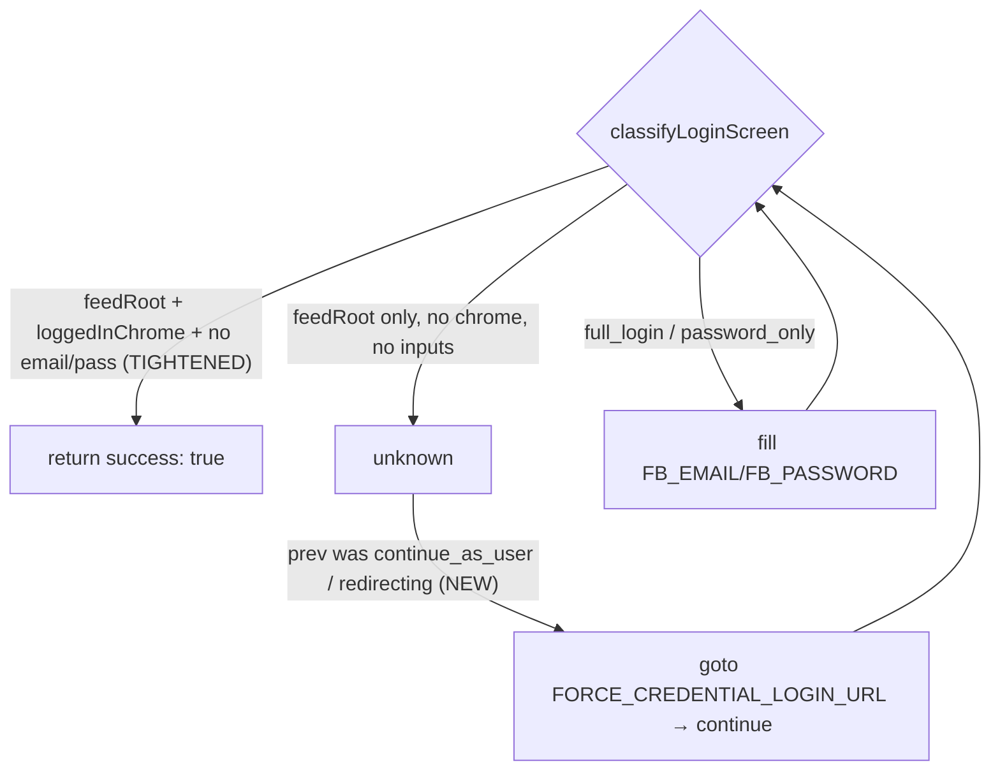
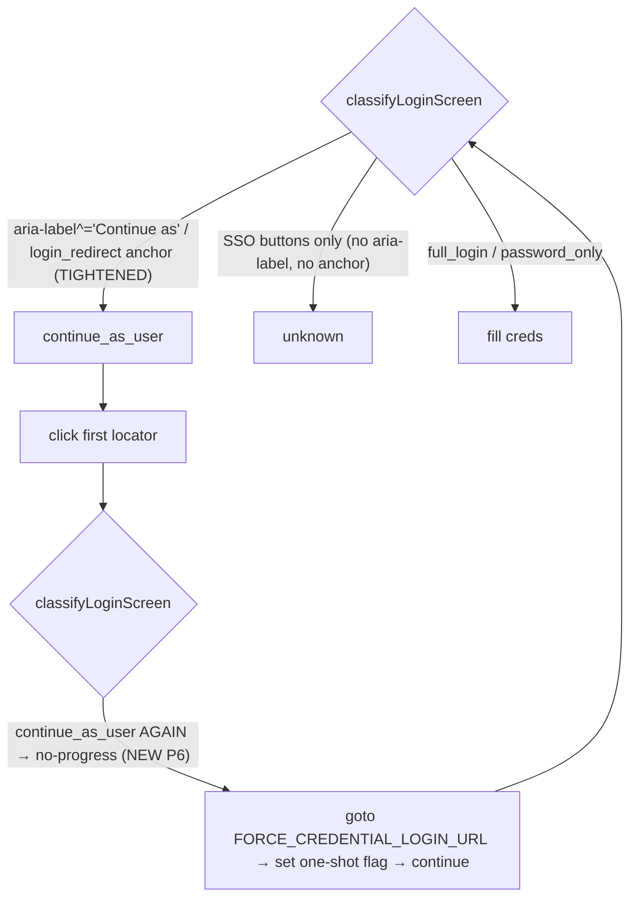

# Facebook Login Recovery Hardening Design

**Spec**: `.specs/features/facebook-login-recovery-hardening/spec.md`
**Status**: Approved

---

## Architecture Overview

The fix lives entirely in the login state machine (`login.ts`). No connector, cursor, DB, or env changes. We introduce one new transient state — `redirecting` — that represents Facebook's one-time login-redirect interstitial (`/?crypted_string=...&next=...`). `classifyLoginScreen()` returns it instead of falsely matching `home_feed`; `attemptLogin()` handles it by *actively* waiting for the redirect to resolve, then re-classifies on the next step. Once the interstitial settles, a truly-expired session renders the logged-out homepage (which carries `input[name="email"]`/`input[name="pass"]`), so the existing `full_login`/`password_only` handlers take over and type the real credentials.

```mermaid
graph TD
    A["auth_expired detected (connector)"] --> B["attemptLogin loop"]
    B --> C{classifyLoginScreen}
    C -->|continue_as_user| D["click 'Continue as'"]
    D --> C
    C -->|"url has crypted_string (NEW)"| R["redirecting: wait for redirect to settle"]
    R --> C
    C -->|full_login / password_only| E["fill FB_EMAIL/FB_PASSWORD"]
    E --> C
    C -->|home_feed (no crypted_string)| S["return success: true"]
    C -->|checkpoint/captcha/2fa/invalid| F["return success: false (reason)"]
    C -->|unknown / no-progress| G["return success: false: unknown_login_page"]
```

**Before (bug):** the `crypted_string` interstitial matched `home_feed` (priority 1: not `/login` + `[role=main]` + no email field yet rendered) → premature `success: true` → credential step skipped.
**After:** the interstitial is `redirecting` → waited out → resolves to the logged-out homepage → `full_login` → credentials entered → real `home_feed`.

---

## Code Reuse Analysis

### Existing Components to Leverage

| Component | Location | How to Use |
| --------- | -------- | ---------- |
| `classifyLoginScreen()` | `packages/connectors/src/facebook/login.ts` | Add interstitial detection as a new top-priority branch; everything else unchanged |
| `attemptLogin()` step loop | `packages/connectors/src/facebook/login.ts` | Add a handler arm for the `redirecting` state; reuse existing no-progress guard for loop safety |
| `LoginScreenState` union | `packages/connectors/src/facebook/login.ts` | Extend with `'redirecting'` |
| `LOGIN_NAVIGATION_TIMEOUT_MS` | `packages/connectors/src/facebook/login.ts` | Reuse as the settle timeout for `waitForURL` |
| `withNavigation()` / `page.waitForLoadState` patterns | `login.ts` | Same XHR/networkidle waiting style for the redirect settle |
| No-progress guard (`prevState === state`) | `attemptLogin()` | Already caps repeated states → guarantees `redirecting` can't loop forever |

### Integration Points

| System | Integration Method |
| ------ | ------------------ |
| `FacebookConnector.fetchGroupWithLoginRecovery` (`index.ts`) | Unchanged — still calls `attemptLogin`, still re-fetches the group to verify, still enforces one-attempt-per-run + disable-on-failure |
| `LoginOutcome` / `LoginFailureReason` (`types.ts`) | Unchanged — no new outcome reasons; `redirecting` is internal to the state machine, never surfaced as an outcome |

---

## Components

### `classifyLoginScreen()` (modify)

- **Purpose**: Add a new highest-priority branch that recognizes the login-redirect interstitial so it is never confused with the home feed.
- **Location**: `packages/connectors/src/facebook/login.ts`
- **Interfaces**:
  - `classifyLoginScreen(page: Page): Promise<LoginScreenState>` — now may return `'redirecting'`.
- **Behavior change**:
  - NEW Priority 0: if `url` contains `crypted_string=` (login-redirect token) → return `'redirecting'`.
  - Priority 1 `home_feed` unchanged otherwise (genuine home URL + feed/main + no email input still returns `home_feed`).
- **Dependencies**: `page.url()` only (pure/stateless — keeps it unit-testable).
- **Reuses**: existing priority-ladder structure.

### `attemptLogin()` (modify)

- **Purpose**: Treat `redirecting` as a non-terminal "wait and re-check" step instead of failing or succeeding.
- **Location**: `packages/connectors/src/facebook/login.ts`
- **Interfaces**: `attemptLogin(page, creds, opts?): Promise<LoginOutcome>` — signature unchanged.
- **Behavior change** — new arm before the generic `unknown` fallthrough:
  - `if (state === 'redirecting')`: actively wait for the redirect to leave the interstitial:
    `await page.waitForURL((u) => !u.toString().includes('crypted_string'), { timeout: LOGIN_NAVIGATION_TIMEOUT_MS }).catch(() => undefined);`
    then, as a deterministic fallback if still stuck, `await page.goto('https://www.facebook.com/', { waitUntil: 'domcontentloaded' }).catch(() => undefined);` then `continue` (re-classify next step).
  - The existing no-progress guard (`prevState === state`) ensures that if `redirecting` recurs with no resolution, the loop bails with `unknown_login_page` (AC P1#4 / P2#4) — no infinite loop.
- **Dependencies**: Playwright `page.waitForURL`, `page.goto`.
- **Reuses**: existing `continue` step semantics, no-progress guard, step/time budget.

### Tests (add)

- **`__tests__/login-classify.test.ts`**: add `redirecting` cases (crypted_string URL with/without `[role=main]`), assert genuine `HOME_URL` still `home_feed`.
- **`__tests__/login-attempt.test.ts`**: add a scripted-sequence test proving `continue_as_user → redirecting → full_login → home_feed` fills credentials and returns `{ success: true }`; add a `redirecting → redirecting` no-progress test returning `unknown_login_page`.

---

## Data Models

No data-model changes. `LoginScreenState` gains one literal:

```typescript
export type LoginScreenState =
  | 'home_feed'
  | 'checkpoint'
  | 'captcha'
  | 'two_factor'
  | 'continue_as_user'
  | 'password_only'
  | 'full_login'
  | 'invalid_credentials'
  | 'save_login_prompt'
  | 'cookie_consent'
  | 'redirecting' // NEW: FB one-time login-redirect interstitial
  | 'unknown';
```

`LoginOutcome`, `FacebookCursorState`, and persisted JSON are untouched.

---

## Error Handling Strategy

| Error Scenario | Handling | User Impact |
| -------------- | -------- | ----------- |
| Interstitial never resolves within budget | No-progress guard / max-steps → `{ success: false, reason: 'unknown_login_page' }` | Account skipped + existing admin alert (accurate reason, not a fake success) |
| Redirect resolves to `/checkpoint/` | classified `checkpoint` → `{ success: false, reason: 'checkpoint' }` | Existing checkpoint alert (manual recovery) |
| `waitForURL` / fallback `goto` throws/times out | `.catch(() => undefined)` → re-classify on current page | Degrades gracefully; no crash |
| Genuine login then group nav still fails | Unchanged: one-attempt cap → disable + alert | Same as `facebook-auto-login` (loop prevention preserved) |

---

## Tech Decisions

| Decision | Choice | Rationale |
| -------- | ------ | --------- |
| Where to fix | `login.ts` only | Connector already verifies via group re-fetch; the sole defect is the false success inside the state machine |
| Detect interstitial by | URL `crypted_string=` substring | It is the unique, stable marker of FB's one-time login redirect; cheap and stateless (keeps `classifyLoginScreen` pure) |
| Resolve interstitial by | active `waitForURL` off `crypted_string` + deterministic `goto('/')` fallback | Observed `networkidle` fires *during* the redirect; a passive wait re-reads the same interstitial. Active URL wait + goto guarantees a settled page |
| New outcome reason? | No | Keep `LoginOutcome` stable; `redirecting` is internal — failures still map to existing `unknown_login_page`/`checkpoint` reasons |
| Reorder `continue_as_user` vs credential priority? | No | After the interstitial settles to the logged-out homepage, the existing `full_login` handler fills credentials; no priority change needed (lower risk to happy path) |

---

## Addendum (2026-06-08): P3/P4/P5 — close the post-interstitial false-positive

The original P1/P2 fix demoted the interstitial *while* `crypted_string` was in the URL. Production run 2026-06-07 showed a deeper variant: by the time the URL settled to `https://www.facebook.com/`, the page was the logged-out marketing splash, but its server-rendered `[role="main"]` shell + the React-hydration delay on the inline login form satisfied the existing `home_feed` heuristic (no `/login`, has `feedRoot`, no email input *yet*). `attemptLogin` returned `success: true`; the next group nav redirected to `/login` and the account was disabled.

### Architecture delta

- `classifyLoginScreen` adds a *positive* logged-in signal to its `home_feed` branch — a feed/main shell alone is no longer sufficient.
- `attemptLogin` gains a recovery branch for the saved-session fakeout: when an iteration following `continue_as_user` or `redirecting` resolves to `unknown`, force the credential URL so the next iteration reaches the password form.
- A new diagnostics module emits a structured fingerprint at every login step and on the auth-expired-after-login retry path so future regressions are debuggable from logs alone.



### Components (delta)

#### `SELECTORS.loggedInChrome` (new constant in `login.ts`)

- **Purpose**: Positive signal that the page is the logged-in feed, not the logged-out splash.
- **Selector**: top-bar Facebook search input (en + he) OR notifications button (en + he) OR `[role="banner"] a[aria-label="Home" i]`. Each variant is locale-resilient and only present on authed pages.

#### `FORCE_CREDENTIAL_LOGIN_URL` (new constant in `login.ts`)

- **Value**: `https://www.facebook.com/login/?login_attempt=1&lwv=110`
- **Purpose**: Clean credential-login URL that bypasses the saved-session UI and exposes the email + password form deterministically.

#### `classifyLoginScreen()` (modify — Priority 1)

- **Before**: `home_feed` if URL is non-`/login` AND `feedRoot` present AND no `emailInput`.
- **After**: `home_feed` if URL is non-`/login` AND `feedRoot` present AND `loggedInChrome` present AND neither `emailInput` nor `passwordInput` is visible.
- **Effect**: the logged-out marketing splash (with email + pass on the inline form) now classifies as `full_login`; a hydrating splash with neither chrome nor inputs classifies as `unknown` (handled by the recovery branch in `attemptLogin`).

#### `attemptLogin()` (modify — saved-session recovery)

- Snapshot `previousIterationState` *before* the no-progress update so handlers can branch on "what got us here" without polluting the no-progress guard.
- New branch before the generic `unknown` fall-through:
  ```ts
  if (state === 'unknown' &&
      (previousIterationState === 'continue_as_user' || previousIterationState === 'redirecting')) {
    logEvent({ event: 'fb_saved_session_invalidated', step, url });
    await page.goto(FORCE_CREDENTIAL_LOGIN_URL, { waitUntil: 'domcontentloaded' }).catch(() => undefined);
    await page.waitForLoadState('networkidle', { timeout: LOGIN_NAVIGATION_TIMEOUT_MS }).catch(() => undefined);
    continue;
  }
  ```
- Loop safety: if the recovery navigation produces another `unknown`, the existing `prevState === state` guard bails on the next iteration → `unknown_login_page`.

#### `diagnostics.ts` (new module)

- **Exports**:
  - `interface FacebookPageFingerprint { url, title, hasFeed, hasMain, hasBanner, hasEmailInput, hasPasswordInput, hasSearchBar, hasNotifications, hasContinueAsUser, hasLoginAnotherAccountLink, htmlLen, cookieNames, hasCUserCookie, hasXsCookie }`
  - `pageFingerprint(page: Page): Promise<FacebookPageFingerprint>` — every selector probe is wrapped in a 1.5s `Promise.race` timeout so a stalled page can never block the caller; missing data falls back to `false` / `null` / `0`.
  - `logPageFingerprint(page: Page, event: string, extra?: Record<string, unknown>): Promise<void>` — emits a single JSON log line; failures during capture are swallowed (diagnostics MUST NEVER break a run).
- **Privacy**: cookie *names* only — values would be a credential leak. `hasCUserCookie` / `hasXsCookie` are convenience flags computed from the names.

#### `FacebookConnector.fetchGroupWithLoginRecovery()` (modify — single emit)

After `attemptLogin` returns success, the post-login retry already exists. The catch arm now also emits `fb_auth_expired_after_login` with the page fingerprint when `errorType` is `auth_expired` or `banned` — this is the single "smoking-gun" log that proves a false-positive `home_feed` slipped through, even when log-line ordering is reordered by the runtime.

### Data Models (delta)

No `LoginScreenState` / `LoginOutcome` / cursor changes — the whole addendum is selector + control-flow + logging. `FacebookPageFingerprint` is a new logging interface only; it is never persisted.

### Tech Decisions (delta)

| Decision | Choice | Rationale |
| -------- | ------ | --------- |
| Tighten `home_feed` by adding | `loggedInChrome` (positive) AND no `passwordInput` (negative) | Single positive signal can be locale-fragile; pairing with the absent-pass-input check makes the rule robust to either variant of the splash |
| Recovery URL | `/login/?login_attempt=1&lwv=110` | The `login_attempt` query param suppresses FB's saved-session shortcut and forces the email/password form; `lwv` is a stable layout-version flag observed across recent FB rollouts |
| Where to capture the fingerprint | `login.ts` (per-step) + `index.ts` (post-login retry catch) | Keeps `attemptLogin` self-contained for the step events; emitting the smoking-gun event from the connector keeps it adjacent to the `auth_expired` it was masking |
| Fingerprint timeout | 1.5s per probe | Diagnostics must never extend run time materially; 1.5s × 12 probes (parallel) ≈ one Promise.all bucket capped at 1.5s wall-clock |
| Save HTML / screenshots | No (deferred) | Selector flags + cookie names + html length cover the diagnosable space without disk pressure or new privacy surface; revisit if a future regression isn't reachable from these flags |

---

## Addendum (2026-06-10): P6 — kill the SSO false-positive `continue_as_user` and recover from no-progress

The 2026-06-08 fix demoted *bad* `home_feed` and added a recovery from `continue_as_user → unknown`. The 2026-06-10 incident exposed a third path: a fully-revoked session served `/login/?next=...` with the email+pass form alongside SSO buttons. The old `continueAsLocators` matched those SSO buttons via a permissive accessible-name regex, so the classifier reported `continue_as_user` for two iterations in a row. Each click was a no-op (the SSO buttons either open OAuth popups or do nothing under Playwright). The no-progress guard fired *before* P4's recovery (which gates on `state === 'unknown'`), so the run terminated with `unknown_login_page`.

### Architecture delta

- `continueAsLocators` is rewritten to match ONLY (a) `aria-label^="Continue as <Name>"` (and locale equivalents) or (b) `a[href*="login_redirect"]`. The broad `getByRole('button', { name: /^(?:Continue|...)\b\s+\S+/ })` and `div[role="button"]` + `span:hasText("Continue")` chain are removed.
- `attemptLogin` gains a one-shot `didForceCredentialRecovery` flag and a new branch placed BEFORE the no-progress guard: when `state === 'continue_as_user'` AND `prevState === 'continue_as_user'` AND the flag is unset, force the credential URL and `continue`.
- Classifier and diagnostics now share their saved-session anchor selector. The selector is also exposed as `SELECTORS.continueAsButton` / `SELECTORS.savedSessionShortcut` so future drift between the classifier and the fingerprint can't recur silently.



### Components (delta)

#### `SELECTORS.continueAsButton` (new constant in `login.ts`)

- **Selector**: aria-label prefix match — `Continue as`, `המשך בתור`, `המשך כ`, `Continuar como`, `Continuer en tant que`, `Weiter als`. Locale-resilient because every saved-session UI sets the aria-label deterministically; prefix match avoids `Continue with X` SSO sibling buttons.

#### `SELECTORS.savedSessionShortcut` (new constant in `login.ts`)

- **Selector**: `a[role="button"][href*="login_redirect"], a[href*="login_redirect"]` — the same selector the diagnostics fingerprint already uses. Sharing the definition is the *invariant* that makes a future classifier-vs-fingerprint disagreement impossible to ship silently.

#### `continueAsLocators(page)` (rewrite)

```ts
return [page.locator(SELECTORS.continueAsButton), page.locator(SELECTORS.savedSessionShortcut)];
```

- Replaces the prior 3-locator list (regex-on-name + filtered text + login_redirect anchor) which was the SSO false-positive source.
- `CONTINUE_LOCALES`, `CONTINUE_RE`, `CONTINUE_EXACT_RE`, and the local `escapeRegex` helper are deleted as unused.

#### `attemptLogin()` (modify — continue-as-user no-progress recovery)

- New `let didForceCredentialRecovery = false;` declared once per call.
- New branch placed BEFORE the existing `if (prevState === state)` no-progress guard:

  ```ts
  if (
    state === 'continue_as_user' &&
    prevState === 'continue_as_user' &&
    !didForceCredentialRecovery
  ) {
    didForceCredentialRecovery = true;
    logEvent({
      event: 'fb_saved_session_invalidated',
      step,
      url,
      detail: 'no_progress_on_continue_as_user',
    });
    await page
      .goto(FORCE_CREDENTIAL_LOGIN_URL, { waitUntil: 'domcontentloaded' })
      .catch(() => undefined);
    await page
      .waitForLoadState('networkidle', { timeout: LOGIN_NAVIGATION_TIMEOUT_MS })
      .catch(() => undefined);
    prevState = state;
    continue;
  }
  ```

- Loop safety: if the recovery navigation lands back on `continue_as_user` (FB redirected away from `/login/?login_attempt=1`), the one-shot flag is already set on the next iteration, so the existing `prevState === state` guard fires and bails — no recovery loop.

### Data Models (delta)

No `LoginScreenState` / `LoginOutcome` / fingerprint changes. The new `SELECTORS.continueAsButton` / `SELECTORS.savedSessionShortcut` are string constants only.

### Tech Decisions (delta)

| Decision | Choice | Rationale |
| -------- | ------ | --------- |
| Tighten saved-session detection by | aria-label prefix match + login_redirect href | Avoids the broad "Continue\b\s+\S+" regex that hit SSO buttons; aria-label is set deterministically by FB on the saved-session UI in every locale we've observed |
| Place recovery branch | BEFORE the no-progress guard | The existing P4 unknown-recovery couldn't catch this — `continue_as_user → continue_as_user` never went through `unknown`, so the no-progress bail won the race. Branch order, not branch content, is the bug |
| One-shot flag vs unbounded retries | One-shot | Bounds the recovery to ≤1 force-navigate per `attemptLogin` call; if the credential URL bounces back to the saved-session UI the next no-progress cycle bails normally. Avoids burning the step cap on re-recovery |
| Single source of truth for saved-session selector | Yes — `SELECTORS.savedSessionShortcut` shared by classifier + fingerprint | The 2026-06-10 incident was diagnosable because they happened to disagree; making them agree by construction prevents the same silent false-positive shape from recurring |
