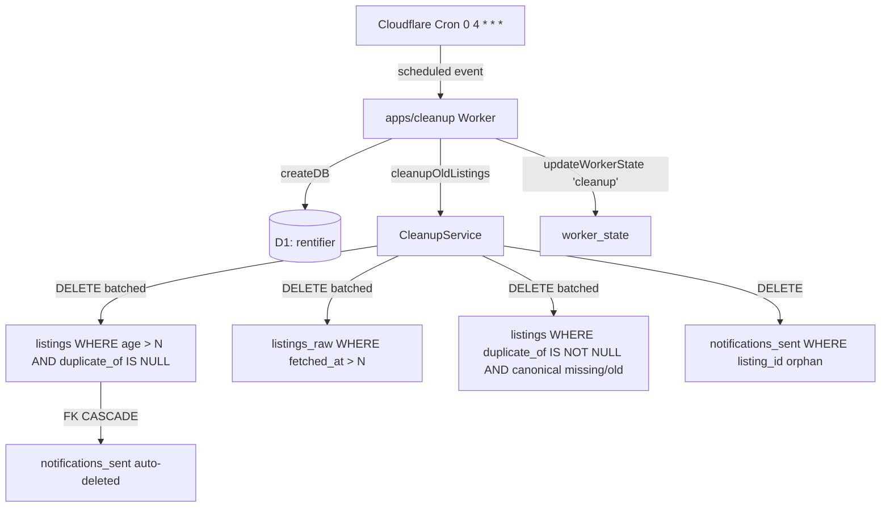

# Listings Cleanup Cron Design

**Spec**: `.specs/features/listings-cleanup-cron/spec.md`
**Status**: Draft

---

## Architecture Overview

A new dedicated Cloudflare Worker `apps/cleanup` runs once per day at 04:00 UTC. It uses the existing `createDB(env.DB)` factory but adds **one new method** — `cleanupOldListings(opts)` — that encapsulates all delete logic in a single place. The worker entrypoint mirrors the shape of `apps/processor` and `apps/notify` (scheduled handler, console logging, `worker_state` upsert on completion).



**Order of operations** (correctness matters because of the self-FK on `listings.duplicate_of`):

1. Delete duplicate listings whose canonical is past retention OR missing — frees pointers.
2. Delete canonical listings past retention — FK cascade kills `notifications_sent`.
3. Delete `listings_raw` past retention — independent table, no FK to `listings`.
4. Defensive sweep: orphan `notifications_sent`.
5. Upsert `worker_state` with run summary.

---

## Code Reuse Analysis

### Existing Components to Leverage

| Component                       | Location                            | How to Use                                                               |
| ------------------------------- | ----------------------------------- | ------------------------------------------------------------------------ |
| `createDB(d1)` factory          | `packages/db/src/queries.ts`        | Add new methods to the `DB` interface; implement on the same factory.    |
| `updateWorkerState`             | `packages/db/src/queries.ts:238`    | Already idempotent upsert — call with `worker_name='cleanup'`.           |
| `apps/processor/src/index.ts`   | scheduled handler skeleton          | Copy shape: `scheduled(event, env, ctx)` + try/catch + console logging.  |
| `apps/processor/wrangler.json`  | wrangler config template            | Copy structure: `name`, `main`, `compatibility_date`, `triggers`, `d1`.  |
| `vitest` test pattern           | `apps/processor/src/__tests__/`     | Mirror partial-DB-mock pattern with `vi.fn()` and inline data fixtures.  |
| Migration sequence convention   | `packages/db/migrations/0001-0016`  | No new migration needed (no schema change). Just additional queries.    |
| Indexes on `listings.ingested_at` | none currently — see Decisions    | We rely on existing PK + filtered scan; verify backfill perf below.     |

### Integration Points

| System                             | Integration Method                                                                                                                                                              |
| ---------------------------------- | ------------------------------------------------------------------------------------------------------------------------------------------------------------------------------- |
| D1 (`rentifier` database)          | Same `database_id` (`554a9f64-3cfb-4e27-b83c-0f92907c8794`) and `migrations_dir` as the other 3 workers; binding name `DB`. No write contention because cleanup runs at 04:00 UTC, **outside** the 05–20 UTC daytime window of collector/processor/notify. |
| Cloudflare Cron Triggers           | `triggers.crons: ["0 4 * * *"]` — daily at 04:00 UTC. Sole cron on this worker.                                                                                                  |
| `worker_state` table               | Already-shared cursor table. New row with `worker_name='cleanup'` will appear on first run.                                                                                      |
| Existing pnpm workspace            | New package `@rentifier/cleanup` with `dependencies.@rentifier/db: workspace:*`. Add `dev:cleanup`, `deploy:cleanup`, `trigger:cleanup` scripts to root `package.json`.            |
| CI (`.github/workflows/ci.yml`)    | Existing `pnpm -r exec tsc --noEmit` and `vitest run` automatically pick up the new package — no workflow change required.                                                       |

---

## Components

### CleanupService

- **Purpose**: Owns the multi-step delete logic, batch-loop control, and result aggregation. Pure business logic, no Workers runtime knowledge — testable with a mocked `DB`.
- **Location**: `apps/cleanup/src/cleanup-service.ts`
- **Interfaces**:
  - `runCleanup(db: DB, opts: CleanupOpts): Promise<CleanupResult>` — single entrypoint called by the worker; orchestrates the 4-step delete order.
- **Dependencies**: `@rentifier/db` (`DB` interface, new cleanup methods)
- **Reuses**: Pattern of `notification-service.ts` and `pipeline.ts` (service module + functional entrypoint).

### Cleanup queries (added to `DB` interface)

- **Purpose**: SQL-level building blocks. Kept on `DB` so the worker is a thin caller and we can unit-test the worker against a mock.
- **Location**: `packages/db/src/queries.ts` (extend `DB` interface and `createDB` body).
- **Interfaces**:
  - `deleteOldListings(retentionDays: number, batchSize: number): Promise<number>` — deletes canonicals with `COALESCE(posted_at, ingested_at) < cutoff AND duplicate_of IS NULL`. Returns rows deleted in this batch.
  - `deleteOldRawListings(retentionDays: number, batchSize: number): Promise<number>` — deletes `listings_raw` with `fetched_at < cutoff`. Returns rows deleted.
  - `deleteOrphanedDuplicates(retentionDays: number, batchSize: number): Promise<number>` — deletes `listings` rows where `duplicate_of IS NOT NULL` AND (`duplicate_of` no longer exists in `listings` OR the referenced canonical's age > retention). Returns rows deleted.
  - `deleteOrphanedNotifications(): Promise<number>` — deletes `notifications_sent` rows where `listing_id NOT IN (SELECT id FROM listings)`. Single statement (defensive, low volume).
- **Dependencies**: Existing `D1Database` binding.
- **Reuses**: SQL patterns from existing queries (parameterised `datetime('now', '-N days')` is standard SQLite).

### Worker entrypoint

- **Purpose**: Cloudflare Workers `scheduled` handler — wires env to service, logs, updates `worker_state`.
- **Location**: `apps/cleanup/src/index.ts`
- **Interfaces**:
  - `default.scheduled(event, env, ctx): Promise<void>`
- **Dependencies**: `@rentifier/db`, `./cleanup-service`
- **Reuses**: Exact shape of `apps/processor/src/index.ts:15`–`46`, with try/catch and JSON-log of summary.

### Wrangler config

- **Purpose**: Cloudflare Worker configuration — name, main, cron, D1 binding.
- **Location**: `apps/cleanup/wrangler.json`
- **Reuses**: Copy of `apps/processor/wrangler.json` minus `vars` and `ai` blocks; `triggers.crons = ["0 4 * * *"]`; observability enabled.

### Tests

- **Purpose**: Verify each delete query in isolation and the orchestrator's order of operations.
- **Location**: `apps/cleanup/src/__tests__/cleanup-service.test.ts` and `packages/db/src/__tests__/queries.test.ts` (the latter only if package tests already exist; otherwise keep cleanup-service-level mock tests as the unit boundary).
- **Reuses**: Same mock-`DB` pattern from `apps/processor/src/__tests__/pipeline.test.ts`.

---

## Data Models

No schema changes. Reading-side reference of involved columns:

```typescript
interface ListingRow {
  id: number;
  posted_at: string | null;   // ISO-8601 from source
  ingested_at: string;        // ISO-8601, default now
  duplicate_of: number | null; // self-FK; canonical iff null
  // ... rest unchanged
}

interface ListingRaw {
  id: number;
  fetched_at: string;         // ISO-8601, default now
  // ... rest unchanged
}
```

```typescript
interface CleanupOpts {
  retentionDays: number;        // default 30
  batchSize: number;            // default 500
  maxDeletesPerRun: number;     // default 50_000 across all tables combined
}

interface CleanupResult {
  listings_deleted: number;
  listings_raw_deleted: number;
  duplicates_deleted: number;
  orphan_notifications_deleted: number;
  capped: boolean;              // true iff hit MAX_DELETES_PER_RUN
  ms: number;                   // wall-clock duration
}
```

---

## SQL specifics

```sql
-- Step 1: orphaned/expiring duplicates (do FIRST so they don't dangle)
DELETE FROM listings
WHERE id IN (
  SELECT d.id
  FROM listings d
  LEFT JOIN listings c ON c.id = d.duplicate_of
  WHERE d.duplicate_of IS NOT NULL
    AND (
      c.id IS NULL
      OR COALESCE(c.posted_at, c.ingested_at) < datetime('now', ?)
    )
  LIMIT ?
);
-- Bind: ('-30 days', 500)

-- Step 2: stale canonical listings (FK CASCADE kills notifications_sent)
DELETE FROM listings
WHERE id IN (
  SELECT id
  FROM listings
  WHERE duplicate_of IS NULL
    AND COALESCE(posted_at, ingested_at) < datetime('now', ?)
  LIMIT ?
);

-- Step 3: stale raw payloads
DELETE FROM listings_raw
WHERE id IN (
  SELECT id
  FROM listings_raw
  WHERE fetched_at < datetime('now', ?)
  LIMIT ?
);

-- Step 4: defensive orphan sweep (cheap, single statement)
DELETE FROM notifications_sent
WHERE listing_id NOT IN (SELECT id FROM listings);
```

The `LIMIT` inside the subquery is required because D1's SQLite build does not support `DELETE … LIMIT` directly. Each method runs the statement in a `while (deleted > 0 && totalDeleted < maxDeletesPerRun)` loop.

---

## Error Handling Strategy

| Error Scenario                                    | Handling                                                                              | User Impact                                                                              |
| ------------------------------------------------- | ------------------------------------------------------------------------------------- | ---------------------------------------------------------------------------------------- |
| D1 statement fails (timeout, network)             | Catch in `runCleanup`, set `worker_state.last_status='error'`, re-throw to Workers   | None directly visible; failed run shows in Cloudflare dashboard. Next day's run retries. |
| `MAX_DELETES_PER_RUN` reached                     | Stop loop, set `result.capped = true`, log warning, succeed normally                  | Backlog catches up over multiple days; a one-time backfill may need a manual override.   |
| Duplicate runs (cron fires twice)                 | Each statement is `WHERE … LIMIT`; deleted rows are no-ops. Worker is idempotent.    | None.                                                                                    |
| `RETENTION_DAYS` invalid (non-numeric, ≤0)        | `parseInt` → `NaN` or ≤0 → throw `Error('Invalid RETENTION_DAYS')` before any delete  | Deploy-time misconfig surfaces immediately as a failed run.                              |
| FK CASCADE doesn't trigger (PRAGMA `foreign_keys=OFF`) | D1 enables FKs by default; documented in ADR. If broken in future, orphan-sweep covers it. | Defensive sweep prevents data corruption.                                                |

---

## Tech Decisions (only non-obvious ones)

| Decision                                                       | Choice                                                              | Rationale                                                                                                                                                                                                  |
| -------------------------------------------------------------- | ------------------------------------------------------------------- | ---------------------------------------------------------------------------------------------------------------------------------------------------------------------------------------------------------- |
| Where does cleanup live?                                       | New worker `apps/cleanup`                                           | Keeps cron triggers separate (Workers list one cron per file), simplifies observability ("cleanup ran" vs "processor ran"), and avoids inflating processor's hot path with infrequent code.                |
| Schedule                                                       | `0 4 * * *` (04:00 UTC, 07:00 IST/IDT)                              | After all daytime cron windows close (`5-20 UTC` collector/processor/notify per AD-023) and before the next 05:00 UTC start. Zero contention.                                                              |
| Delete via subquery instead of `DELETE … LIMIT`                | `DELETE FROM t WHERE id IN (SELECT id FROM t WHERE … LIMIT N)`      | D1's SQLite build is compiled without `SQLITE_ENABLE_UPDATE_DELETE_LIMIT`. Subquery + `LIMIT` is the canonical workaround.                                                                                  |
| Delete duplicates BEFORE canonicals                            | Step 1 runs first                                                   | Avoids leaving rows whose `duplicate_of` points to a deleted canonical. Although there is no enforced FK on the self-reference (no ON DELETE CASCADE), correctness for `findDuplicate()`/`getNewListingsSince()` requires duplicates to vanish with their canonical. |
| Index on `(COALESCE(posted_at, ingested_at), duplicate_of)`?   | **No index** for v1; revisit if scan time exceeds 5 s              | At ~50k rows the full scan is ~50ms in D1. Adding an index has write cost on every `upsertListing`. We have a partial index `idx_listings_dedup` already; adding another is premature optimisation.        |
| Should orphan-notifications sweep run every day?               | Yes, but as a single un-batched statement                           | Volume should be ~0 because of FK CASCADE. Defensive only; cost is one COUNT-ish statement per day.                                                                                                       |
| `MAX_DELETES_PER_RUN` default                                  | 50,000                                                              | Conservative enough to fit in 30 s wall-clock with batches of 500 and ≤ 100 round-trips. Backfill of larger backlogs covered by multiple nights.                                                           |
| Migration?                                                     | None                                                                | All DELETEs use existing columns. New worker = no schema change.                                                                                                                                           |

---

## Out-of-band manual operations

The same `cleanupService.runCleanup(db, opts)` function will be importable from a one-shot script (`scripts/cleanup-listings.ts`) for the inevitable first-time backfill where MAX_DELETES_PER_RUN may not suffice. **Not built in v1** — call out as a future task only if needed.
