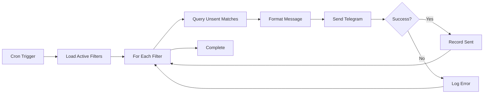

# Notify Worker Design

**Spec**: `.specs/features/notify-worker/spec.md`
**Status**: Draft

---

## Architecture Overview

The notify worker is a cron-triggered Cloudflare Worker that matches new canonical listings against user filters and sends Telegram notifications. It queries for unsent matches, formats messages, calls the Telegram Bot API, and records successful sends to guarantee idempotency.



**Data Flow:**
1. Query all enabled filters (for M1: single hardcoded user)
2. For each filter, execute match query with filter criteria + anti-join on `notifications_sent`
3. For each match:
   - Format Telegram message (title, price, rooms, location, link)
   - POST to `https://api.telegram.org/bot<token>/sendMessage`
   - If success (200 response), insert `(user_id, listing_id, sent_at, channel='telegram')` into `notifications_sent`
   - If failure (rate limit, network), log error and skip recording (will retry on next cron)

---

## Code Reuse Analysis

**Greenfield project** — this worker establishes the notification pattern.

**Shared Package Dependencies:**
- `@rentifier/core`: `Listing`, `Filter` types
- `@rentifier/db`: `findActiveFilters()`, `matchListingsForFilter()`, `recordNotificationSent()` query helpers

**Patterns to Establish:**
- Idempotent notification via `(user_id, listing_id)` unique constraint
- Telegram API error handling (rate limits, timeouts)
- Message formatting with Hebrew/English mixed text
- Structured logging with user_id/listing_id/filter_id context

---

## Components

### NotifyWorker (Scheduled Handler)
- **Purpose**: Cron entry point, orchestrates notification loop
- **Location**: `apps/notify/src/index.ts`
- **Interfaces**:
  ```typescript
  export default {
    async scheduled(
      event: ScheduledEvent,
      env: Env,
      ctx: ExecutionContext
    ): Promise<void>
  }

  interface Env {
    DB: D1Database;
    TELEGRAM_BOT_TOKEN: string; // Cloudflare secret
  }
  ```
- **Dependencies**: `NotificationService`, `@rentifier/db`

### NotificationService
- **Purpose**: Core orchestration — match filters, send notifications, record sends
- **Location**: `apps/notify/src/notification-service.ts`
- **Interfaces**:
  ```typescript
  export class NotificationService {
    constructor(
      private db: D1Database,
      private telegram: TelegramClient
    ) {}

    async processNotifications(): Promise<NotificationResult>
  }

  interface NotificationResult {
    sent: number;
    failed: number;
    errors: NotificationError[];
  }

  interface NotificationError {
    userId: number;
    listingId: number;
    filterId: number;
    error: string;
  }
  ```
- **Dependencies**: `@rentifier/db`, `TelegramClient`, `MessageFormatter`

### TelegramClient
- **Purpose**: Wraps Telegram Bot API with error handling and retry logic
- **Location**: `apps/notify/src/telegram-client.ts`
- **Interfaces**:
  ```typescript
  export class TelegramClient {
    constructor(private botToken: string) {}

    async sendMessage(
      chatId: string,
      text: string,
      parseMode: 'HTML' | 'MarkdownV2' = 'HTML'
    ): Promise<TelegramSendResult>
  }

  interface TelegramSendResult {
    success: boolean;
    messageId?: number;
    error?: string;
    retryable?: boolean; // true for rate limits, false for invalid chat_id
  }
  ```
- **Dependencies**: Fetch API

### MessageFormatter
- **Purpose**: Formats listing into readable Telegram HTML message
- **Location**: `apps/notify/src/message-formatter.ts`
- **Interfaces**:
  ```typescript
  export class MessageFormatter {
    format(listing: Listing): string
  }

  // Example output:
  // <b>דירת 3 חדרים בתל אביב</b>
  // 💰 ₪4,500/month
  // 🏠 3 rooms
  // 📍 Tel Aviv - Florentin
  // <a href="https://...">View Listing</a>
  ```
- **Dependencies**: `@rentifier/core`

---

## Data Models

### Filter (from `@rentifier/core`):
```typescript
interface Filter {
  id: number;
  userId: number;
  name: string;
  enabled: boolean;

  // Numeric ranges (null = no constraint)
  minPrice?: number;
  maxPrice?: number;
  minBedrooms?: number;
  maxBedrooms?: number;

  // List filters (JSON arrays, null = no constraint)
  citiesJson?: string; // ["תל אביב", "חיפה"]
  neighborhoodsJson?: string;
  keywordsJson?: string; // LIKE match in title/description
  mustHaveTagsJson?: string; // All must be present
  excludeTagsJson?: string; // None can be present
}
```

### NotificationRecord:
```typescript
interface NotificationRecord {
  id: number; // Auto-increment
  userId: number;
  listingId: number;
  sentAt: Date;
  channel: 'telegram'; // Future: 'email', 'whatsapp'

  // Unique constraint: (user_id, listing_id)
}
```

---

## Filter Matching Logic

### Match Query (SQL)
```sql
-- Hot path query #2: Find listings matching filter that haven't been sent
SELECT
  l.id,
  l.source_id,
  l.source_item_id,
  l.title,
  l.description,
  l.url,
  l.price,
  l.currency,
  l.price_period,
  l.bedrooms,
  l.city,
  l.neighborhood,
  l.area_text,
  l.tags_json,
  l.posted_at,
  l.ingested_at
FROM listings l
LEFT JOIN notifications_sent ns
  ON l.id = ns.listing_id
  AND ns.user_id = ?
WHERE
  ns.id IS NULL -- Not yet sent to this user
  AND (? IS NULL OR l.price >= ?) -- minPrice
  AND (? IS NULL OR l.price <= ?) -- maxPrice
  AND (? IS NULL OR l.bedrooms >= ?) -- minBedrooms
  AND (? IS NULL OR l.bedrooms <= ?) -- maxBedrooms
  AND (? IS NULL OR l.city IN (SELECT value FROM json_each(?))) -- citiesJson
  AND (? IS NULL OR l.neighborhood IN (SELECT value FROM json_each(?))) -- neighborhoodsJson
  -- Keywords: ANY match in title or description
  AND (
    ? IS NULL
    OR EXISTS (
      SELECT 1 FROM json_each(?) AS kw
      WHERE l.title LIKE '%' || kw.value || '%'
         OR l.description LIKE '%' || kw.value || '%'
    )
  )
  -- Must-have tags: ALL must be present
  AND (
    ? IS NULL
    OR NOT EXISTS (
      SELECT 1 FROM json_each(?) AS tag
      WHERE NOT EXISTS (
        SELECT 1 FROM json_each(l.tags_json) AS listing_tag
        WHERE listing_tag.value = tag.value
      )
    )
  )
  -- Exclude tags: NONE can be present
  AND (
    ? IS NULL
    OR NOT EXISTS (
      SELECT 1 FROM json_each(?) AS exclude_tag
      WHERE EXISTS (
        SELECT 1 FROM json_each(l.tags_json) AS listing_tag
        WHERE listing_tag.value = exclude_tag.value
      )
    )
  )
ORDER BY l.ingested_at DESC
LIMIT 100; -- Safety limit per filter
```

**Index requirements**:
- `notifications_sent(user_id, listing_id)` (unique constraint provides index)
- `listings(ingested_at)` for ORDER BY
- `listings(price, bedrooms)` composite for range filters

**Note**: SQLite `json_each()` is available in D1 for JSON array iteration.

### Idempotency Guarantee (SQL)
```sql
-- Record successful send
INSERT INTO notifications_sent (user_id, listing_id, sent_at, channel)
VALUES (?, ?, CURRENT_TIMESTAMP, 'telegram')
ON CONFLICT(user_id, listing_id) DO NOTHING;
```
**Behavior**: If already sent, silently ignores. This makes the operation idempotent.

---

## Notification Flow

### Main Processing Loop
```typescript
async processNotifications(): Promise<NotificationResult> {
  const filters = await this.db.findActiveFilters();

  const results: NotificationResult = {
    sent: 0,
    failed: 0,
    errors: []
  };

  for (const filter of filters) {
    const matches = await this.db.matchListingsForFilter(filter);

    if (matches.length === 0) continue;

    for (const listing of matches) {
      try {
        // Step 1: Format message
        const message = this.formatter.format(listing);

        // Step 2: Get user's chat_id
        const user = await this.db.getUserById(filter.userId);
        if (!user.telegramChatId) {
          throw new Error('User has no telegram_chat_id');
        }

        // Step 3: Send via Telegram
        const sendResult = await this.telegram.sendMessage(
          user.telegramChatId,
          message,
          'HTML'
        );

        if (!sendResult.success) {
          // Rate limit or transient error — don't record, will retry
          if (sendResult.retryable) {
            results.failed++;
            results.errors.push({
              userId: filter.userId,
              listingId: listing.id,
              filterId: filter.id,
              error: sendResult.error || 'Unknown error'
            });
            continue;
          } else {
            // Permanent error (invalid chat_id) — skip user
            throw new Error(sendResult.error);
          }
        }

        // Step 4: Record send
        await this.db.recordNotificationSent({
          userId: filter.userId,
          listingId: listing.id,
          channel: 'telegram'
        });

        results.sent++;

      } catch (error) {
        results.failed++;
        results.errors.push({
          userId: filter.userId,
          listingId: listing.id,
          filterId: filter.id,
          error: error instanceof Error ? error.message : String(error)
        });
      }
    }
  }

  return results;
}
```

### Telegram API Call
```typescript
async sendMessage(
  chatId: string,
  text: string,
  parseMode: 'HTML' | 'MarkdownV2' = 'HTML'
): Promise<TelegramSendResult> {
  const url = `https://api.telegram.org/bot${this.botToken}/sendMessage`;

  try {
    const response = await fetch(url, {
      method: 'POST',
      headers: { 'Content-Type': 'application/json' },
      body: JSON.stringify({
        chat_id: chatId,
        text: text,
        parse_mode: parseMode,
        disable_web_page_preview: false
      })
    });

    if (!response.ok) {
      const error = await response.json();

      // Detect rate limit (HTTP 429)
      if (response.status === 429) {
        return {
          success: false,
          error: 'Rate limit exceeded',
          retryable: true
        };
      }

      // Detect invalid chat_id (HTTP 400)
      if (response.status === 400 && error.description?.includes('chat not found')) {
        return {
          success: false,
          error: 'Invalid chat_id',
          retryable: false
        };
      }

      return {
        success: false,
        error: error.description || 'Unknown Telegram error',
        retryable: true
      };
    }

    const data = await response.json();
    return {
      success: true,
      messageId: data.result?.message_id
    };

  } catch (error) {
    // Network error — retryable
    return {
      success: false,
      error: error instanceof Error ? error.message : 'Network error',
      retryable: true
    };
  }
}
```

---

## Message Formatting

### HTML Template
```typescript
format(listing: Listing): string {
  const parts: string[] = [];

  // Title (bold)
  parts.push(`<b>${this.escapeHtml(listing.title)}</b>`);

  // Price
  if (listing.price && listing.currency) {
    const formatted = this.formatPrice(
      listing.price,
      listing.currency,
      listing.pricePeriod
    );
    parts.push(`💰 ${formatted}`);
  }

  // Bedrooms
  if (listing.bedrooms !== null && listing.bedrooms !== undefined) {
    const roomsText = listing.bedrooms === 0
      ? 'Studio'
      : `${listing.bedrooms} rooms`;
    parts.push(`🏠 ${roomsText}`);
  }

  // Location
  if (listing.city) {
    const location = listing.neighborhood
      ? `${listing.city} - ${listing.neighborhood}`
      : listing.city;
    parts.push(`📍 ${this.escapeHtml(location)}`);
  }

  // Link
  parts.push(`<a href="${listing.url}">View Listing</a>`);

  return parts.join('\n');
}

private formatPrice(
  amount: number,
  currency: string,
  period?: string
): string {
  const symbol = currency === 'ILS' ? '₪' : currency;
  const periodText = period ? `/${period}` : '';
  return `${symbol}${amount.toLocaleString('en-US')}${periodText}`;
}

private escapeHtml(text: string): string {
  return text
    .replace(/&/g, '&amp;')
    .replace(/</g, '&lt;')
    .replace(/>/g, '&gt;')
    .replace(/"/g, '&quot;');
}
```

### Example Output
```
<b>דירת 3 חדרים בפלורנטין</b>
💰 ₪4,500/month
🏠 3 rooms
📍 Tel Aviv - Florentin
<a href="https://www.yad2.co.il/item/abc123">View Listing</a>
```

---

## Error Handling Strategy

| Scenario | Behavior | Rationale |
|----------|----------|-----------|
| No active filters | Exit cleanly, log "no work" | Normal state for new system |
| Filter matches 0 listings | Continue to next filter | Not an error |
| Telegram rate limit (429) | Skip remaining, log error, exit | Next cron run continues from where left off |
| Invalid chat_id (400) | Skip user, log error, continue | User config issue, don't block others |
| Network timeout | Skip message, log error, continue | Transient — will retry on next cron |
| Send succeeds but record fails | Duplicate message on retry | Acceptable — better than missed notification |
| Record succeeds but was already sent | No-op (ON CONFLICT DO NOTHING) | Idempotency guarantee |
| Listing matches multiple filters (same user) | Only one notification sent | `(user_id, listing_id)` is unique |

**Logging Context**: Every log includes `{ userId, listingId, filterId, sent, failed }`

---

## Tech Decisions

| Decision | Rationale | Trade-off |
|----------|-----------|-----------|
| HTML parse mode (not MarkdownV2) | Simpler escaping, more forgiving | Less rich formatting options |
| Inline send-and-record (not batched) | Simplicity + idempotency via unique constraint | More DB writes, but D1 handles it |
| Match query limit: 100 per filter | Prevent runaway queries | If 200 new listings match, user gets 100, then 100 on next cycle |
| No Telegram API retry logic | Cron retry is sufficient | Adds ~5min delay for transient errors |
| Single user (M1) with hardcoded ID | Simplifies auth/registration for MVP | Multi-user requires filters.user_id FK + registration flow |
| Record send AFTER Telegram success | Guarantees notification was actually sent | Crash between send/record = duplicate (acceptable) |
| ORDER BY ingested_at DESC | Users see newest listings first | Older listings may never send if queue > 100 |

---

## Worker Configuration

### wrangler.toml
```toml
name = "rentifier-notify"
main = "src/index.ts"
compatibility_date = "2024-01-01"

[[d1_databases]]
binding = "DB"
database_name = "rentifier"
database_id = "..." # Same as processor

[triggers]
crons = ["*/5 * * * *"] # Every 5 minutes

[vars]
# No public vars

# Secrets (set via `wrangler secret put TELEGRAM_BOT_TOKEN`)
# TELEGRAM_BOT_TOKEN = "..."
```

### Environment Bindings
- `DB`: D1 database binding
- `TELEGRAM_BOT_TOKEN`: Cloudflare secret (set via CLI, never in code)

---

## Testing Strategy

### Unit Tests (Vitest)
- `MessageFormatter.format()` with various listing field combinations
- `TelegramClient.sendMessage()` with mock fetch (success, rate limit, invalid chat)
- `NotificationService.processNotifications()` with mock DB and Telegram

### Integration Tests (Miniflare)
- End-to-end: insert user + filter + matching listing, trigger scheduled handler, verify `notifications_sent` row
- Idempotency: trigger twice, verify only one `notifications_sent` row
- Filter logic: insert listings that match/don't match, verify correct matches

### Acceptance Test Plan
1. Create user with telegram_chat_id (real test chat)
2. Create filter: max_price=5000, cities=["תל אביב"]
3. Insert matching listing (price=4500, city="תל אביב")
4. Trigger notify worker (manual `wrangler dev`)
5. Verify Telegram message received in test chat
6. Query `notifications_sent` → expect 1 row
7. Trigger again → expect 0 sent (already recorded)
8. Insert new matching listing → expect 1 new message

---

## Deployment Checklist

- [ ] `@rentifier/db` migrations include `users`, `filters`, `notifications_sent` tables
- [ ] Telegram bot created via @BotFather, token stored as Cloudflare secret
- [ ] Test user inserted into `users` with valid `telegram_chat_id`
- [ ] Test filter created with reasonable criteria
- [ ] Worker deployed with `wrangler deploy`
- [ ] Cron trigger verified in Cloudflare dashboard
- [ ] Send test message to verify bot token works

---

## Future Enhancements (Out of Scope for M1)

- **Multi-user support**: Registration flow via Telegram bot commands (`/start`, `/filter`)
- **Notification batching**: Send digest of 5-10 listings instead of individual messages
- **Rich media**: Include listing photos inline (requires image storage)
- **Inline buttons**: "Save", "Hide", "More Like This" actions
- **WhatsApp/Email channels**: Add `channel` variants beyond Telegram
- **Rate limit backoff**: Exponential retry for 429 errors instead of waiting for next cron
- **User preferences**: Notification schedule (e.g., "only 9am-6pm"), frequency caps
