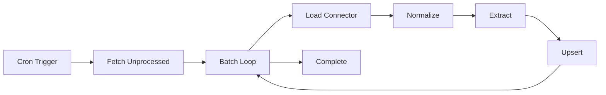

# Processor Worker Design

**Spec**: `.specs/features/processor-worker/spec.md`
**Status**: Draft

---

## Architecture Overview

The processor worker is a cron-triggered Cloudflare Worker that transforms raw listings into canonical structured data. It queries for unprocessed raw listings, normalizes them via source-specific connectors, extracts structured fields using rule-based patterns, and upserts the result into the canonical `listings` table.



**Data Flow:**
1. Query `listings_raw` for rows where `(source_id, source_item_id)` NOT IN `listings`
2. For each raw listing (up to batch size):
   - Retrieve connector by `source_id`
   - Call `connector.normalize(candidate)` → `ListingDraft`
   - Run extraction pipeline → enriched `ListingDraft`
   - Upsert to `listings` with `ON CONFLICT(source_id, source_item_id) DO UPDATE`
3. Exit when batch completes or no unprocessed rows remain

---

## Code Reuse Analysis

**Greenfield project** — this worker establishes the first implementation of the processor pattern.

**Shared Package Dependencies:**
- `@rentifier/core`: `Listing`, `ListingCandidate`, `ListingDraft` types + Zod schemas
- `@rentifier/db`: `findUnprocessedRaw()`, `upsertListing()` query helpers
- `@rentifier/connectors`: `ConnectorRegistry`, connector interface
- `@rentifier/extraction`: `extractAll()`, individual extractors

**Patterns to Establish:**
- Batch processing with configurable limits (default: 50)
- Per-item error isolation (one bad listing doesn't crash the batch)
- Structured logging with source_id/source_item_id context
- Idempotent processing via upsert conflict resolution

---

## Components

### ProcessorWorker (Scheduled Handler)
- **Purpose**: Cron entry point, orchestrates batch processing
- **Location**: `apps/processor/src/index.ts`
- **Interfaces**:
  ```typescript
  export default {
    async scheduled(
      event: ScheduledEvent,
      env: Env,
      ctx: ExecutionContext
    ): Promise<void>
  }

  interface Env {
    DB: D1Database;
    BATCH_SIZE?: string; // default "50"
  }
  ```
- **Dependencies**: `ProcessingPipeline`, `@rentifier/db`

### ProcessingPipeline
- **Purpose**: Core orchestration — fetch, normalize, extract, upsert loop
- **Location**: `apps/processor/src/pipeline.ts`
- **Interfaces**:
  ```typescript
  export class ProcessingPipeline {
    constructor(
      private db: D1Database,
      private connectors: ConnectorRegistry,
      private batchSize: number = 50
    ) {}

    async processBatch(): Promise<ProcessingResult>
  }

  interface ProcessingResult {
    processed: number;
    failed: number;
    errors: ProcessingError[];
  }

  interface ProcessingError {
    sourceId: string;
    sourceItemId: string;
    error: string;
  }
  ```
- **Dependencies**: `@rentifier/db`, `@rentifier/connectors`, `NormalizationService`, `ExtractionService`

### NormalizationService
- **Purpose**: Delegates to appropriate connector's `normalize()` method
- **Location**: `apps/processor/src/normalization.ts`
- **Interfaces**:
  ```typescript
  export class NormalizationService {
    constructor(private connectors: ConnectorRegistry) {}

    async normalize(
      candidate: ListingCandidate
    ): Promise<ListingDraft | null>
  }
  ```
- **Dependencies**: `@rentifier/connectors`, `@rentifier/core`

### ExtractionService
- **Purpose**: Wraps extraction pipeline with error handling and confidence scoring
- **Location**: `apps/processor/src/extraction.ts`
- **Interfaces**:
  ```typescript
  export class ExtractionService {
    async extract(draft: ListingDraft): Promise<ListingDraft>
  }

  // Enriches draft with:
  // - price, currency, price_period
  // - bedrooms
  // - city, neighborhood
  // - tags_json
  // - relevance_score
  ```
- **Dependencies**: `@rentifier/extraction`, `@rentifier/core`

---

## Data Models

### Inputs (from `@rentifier/core`):
```typescript
interface ListingCandidate {
  sourceId: string;
  sourceItemId: string;
  url: string;
  rawJson: string; // Original source payload
  fetchedAt: Date;
}
```

### Intermediate (normalization output):
```typescript
interface ListingDraft {
  // Required by connector
  title: string;
  description: string;
  url: string;
  sourceId: string;
  sourceItemId: string;

  // Optional (may be partially filled by connector)
  postedAt?: Date;

  // Filled by extraction pipeline
  price?: number;
  currency?: string;
  pricePeriod?: 'day' | 'week' | 'month';
  bedrooms?: number;
  city?: string;
  neighborhood?: string;
  areaText?: string;
  tagsJson?: string; // JSON array
  relevanceScore?: number;
}
```

### Output (upserted to `listings`):
```typescript
interface Listing extends ListingDraft {
  id: number; // Auto-increment primary key
  ingestedAt: Date; // Set on first insert, preserved on update
}
```

---

## Processing Logic

### Unprocessed Query (SQL)
```sql
-- Hot path query #1: Find raw listings not yet canonical
SELECT
  lr.source_id,
  lr.source_item_id,
  lr.url,
  lr.raw_json,
  lr.fetched_at
FROM listings_raw lr
LEFT JOIN listings l
  ON lr.source_id = l.source_id
  AND lr.source_item_id = l.source_item_id
WHERE l.id IS NULL
LIMIT ?;
```
**Index requirement**: `listings_raw(source_id, source_item_id)`, `listings(source_id, source_item_id)`

### Upsert Query (SQL)
```sql
-- Idempotent upsert pattern
INSERT INTO listings (
  source_id, source_item_id, title, description, url,
  price, currency, price_period, bedrooms,
  city, neighborhood, area_text,
  tags_json, relevance_score, posted_at, ingested_at
) VALUES (?, ?, ?, ?, ?, ?, ?, ?, ?, ?, ?, ?, ?, ?, ?, CURRENT_TIMESTAMP)
ON CONFLICT(source_id, source_item_id) DO UPDATE SET
  title = excluded.title,
  description = excluded.description,
  price = excluded.price,
  currency = excluded.currency,
  price_period = excluded.price_period,
  bedrooms = excluded.bedrooms,
  city = excluded.city,
  neighborhood = excluded.neighborhood,
  area_text = excluded.area_text,
  tags_json = excluded.tags_json,
  relevance_score = excluded.relevance_score,
  posted_at = excluded.posted_at
  -- NOTE: ingested_at is NOT updated (preserves first-seen time)
WHERE excluded.source_id IS NOT NULL;
```
**Guarantees**: Reprocessing updates fields but preserves `ingested_at` and `id`.

### Batch Processing Flow
```typescript
async processBatch(): Promise<ProcessingResult> {
  const unprocessed = await this.db.findUnprocessedRaw(this.batchSize);

  if (unprocessed.length === 0) {
    return { processed: 0, failed: 0, errors: [] };
  }

  const results: ProcessingResult = {
    processed: 0,
    failed: 0,
    errors: []
  };

  for (const raw of unprocessed) {
    try {
      // Step 1: Normalize
      const draft = await this.normalizationService.normalize({
        sourceId: raw.source_id,
        sourceItemId: raw.source_item_id,
        url: raw.url,
        rawJson: raw.raw_json,
        fetchedAt: new Date(raw.fetched_at)
      });

      if (!draft) {
        // Connector not found or normalization returned null
        results.failed++;
        results.errors.push({
          sourceId: raw.source_id,
          sourceItemId: raw.source_item_id,
          error: 'Normalization failed'
        });
        continue;
      }

      // Step 2: Extract
      const enriched = await this.extractionService.extract(draft);

      // Step 3: Upsert
      await this.db.upsertListing(enriched);

      results.processed++;

    } catch (error) {
      // Per-item error isolation
      results.failed++;
      results.errors.push({
        sourceId: raw.source_id,
        sourceItemId: raw.source_item_id,
        error: error instanceof Error ? error.message : String(error)
      });
    }
  }

  return results;
}
```

---

## Error Handling Strategy

| Scenario | Behavior | Rationale |
|----------|----------|-----------|
| Unprocessed query returns 0 rows | Exit cleanly, log "no work" | Normal idle state |
| Raw JSON is malformed | Skip row, log error, continue batch | Isolate bad data |
| Connector not found for source_id | Skip row, log warning, continue | Source might be disabled |
| Normalization throws | Skip row, log error, continue | Connector bug shouldn't crash worker |
| Extraction throws | Skip row, log error, continue | Parsing failure is recoverable |
| Upsert fails (DB constraint) | Fail the item, log error, continue | Should not happen (unique constraint is expected) |
| DB connection lost mid-batch | Worker crashes, cron retries | Cloudflare Workers retry behavior |
| Batch exceeds CPU limit | Worker terminates, cron retries, processes next batch | Acceptable — batching ensures forward progress |

**Logging Context**: Every log includes `{ sourceId, sourceItemId, batchSize, processed, failed }`

---

## Tech Decisions

| Decision | Rationale | Trade-off |
|----------|-----------|-----------|
| Batch size default: 50 | Balance between progress and CPU limits (10ms/request ideal, <50ms max) | Larger batches = fewer cron invocations but risk timeout |
| Per-item try/catch | One bad listing doesn't block the batch | More complex code, but essential for reliability |
| LEFT JOIN anti-pattern for unprocessed | Simpler than NOT EXISTS, works well at low scale | May not scale to 100K+ listings (future: pagination) |
| Preserve `ingested_at` on conflict | First-seen time is semantically correct for "new listing" filters | Requires explicit exclusion in UPDATE clause |
| Synchronous batch loop (no parallelism) | Simplicity + D1 is single-connection, no concurrency benefit | Could parallelize normalization/extraction if CPU-bound |
| Connector registry is in-memory map | Fast lookup, works for 5-10 connectors | If 100+ connectors, move to DB-driven registry |
| No retry logic for failed items | Cron will re-attempt on next run since upsert is idempotent | Transient errors (network) may delay processing by one cycle |

---

## Worker Configuration

### wrangler.toml
```toml
name = "rentifier-processor"
main = "src/index.ts"
compatibility_date = "2024-01-01"

[[d1_databases]]
binding = "DB"
database_name = "rentifier"
database_id = "..." # Set via wrangler d1 create

[triggers]
crons = ["*/15 * * * *"] # Every 15 minutes

[vars]
BATCH_SIZE = "50"
```

### Environment Bindings
- `DB`: D1 database binding
- `BATCH_SIZE`: Optional override (string, parsed to number)

---

## Testing Strategy

### Unit Tests (Vitest)
- `NormalizationService.normalize()` with mock connector
- `ExtractionService.extract()` with sample drafts
- `ProcessingPipeline.processBatch()` with mock DB and connectors

### Integration Tests (Miniflare)
- End-to-end: insert raw listing, trigger scheduled handler, verify canonical listing exists
- Idempotency: process same batch twice, verify no duplicates
- Error isolation: insert 3 raw listings (1 malformed JSON), verify 2 processed

### Acceptance Test Plan
1. Insert 3 raw listings from different sources
2. Trigger processor (manual `wrangler dev`)
3. Query `listings` → expect 3 rows with extracted fields
4. Trigger processor again → expect 0 processed (all already canonical)
5. Update a raw listing's price, re-insert with conflict → verify canonical price updated but `ingested_at` unchanged

---

## Deployment Checklist

- [ ] `@rentifier/db` migrations applied to D1 production instance
- [ ] `@rentifier/connectors` has at least one registered connector
- [ ] `@rentifier/extraction` extraction pipeline tested with Hebrew text
- [ ] Worker deployed with `wrangler deploy`
- [ ] Cron trigger verified in Cloudflare dashboard
- [ ] Test with 1-2 real raw listings before enabling all sources

---

## Future Enhancements (Out of Scope for M1)

- **Pagination for large unprocessed batches**: Add cursor-based iteration if >10K raw listings accumulate
- **AI fallback extraction**: Call Cloudflare Workers AI for ambiguous text when rule extraction fails
- **Cross-source deduplication**: Detect same apartment from YAD2 + Facebook (requires fuzzy matching)
- **Relevance scoring ML model**: Train classifier on user feedback to improve `relevance_score`
- **Parallel batch processing**: Use `Promise.all()` for normalization/extraction if CPU becomes bottleneck
